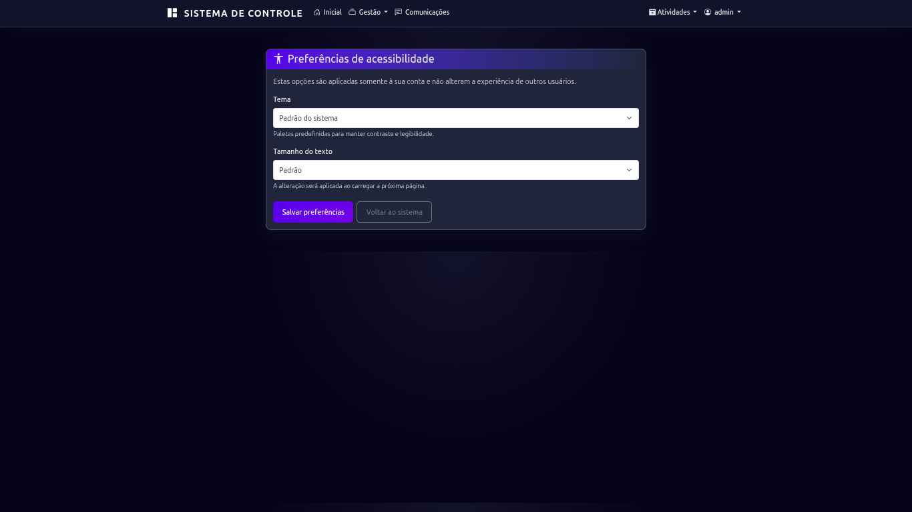

# Guia rápido do Sistema BMCM

Este guia explica as tarefas mais comuns do sistema, sem exigir conhecimento técnico. As opções que aparecem para você dependem do seu tipo de acesso. Se uma opção não estiver disponível ou algo não funcionar, peça ajuda ao administrador do sistema.

## 1. Entrar no sistema

1. Abra no navegador o endereço do sistema fornecido pela Banda.
2. Informe seu usuário e sua senha.
3. Clique em **Entrar**.

No primeiro acesso, siga a orientação para trocar a senha inicial. Se esquecer a senha ou não conseguir entrar, entre em contato com o administrador.

## 2. Encontrar as opções

Use a barra no alto da tela:

* **Inicial**: volta ao painel principal.
* **Gestão**: reúne integrantes e instrumentos. A opção **Usuários** aparece somente para administradores.
* **Atividades**: reúne calendário, ensaios, atividades, eventos e consultas de presença.
* **Comunicações**: abre os avisos e mensagens, quando estiver disponível para sua conta.
* **Seu nome**: abre opções da conta, acessibilidade e, para administradores, tarefas administrativas.

Em celular, toque no botão do menu para abrir ou fechar a navegação. Para voltar de uma tela, use o botão **Voltar** quando existir ou o menu superior.

## 3. Ajustar a aparência para você

1. Abra o menu com seu nome.
2. Escolha **Acessibilidade**.
3. Selecione um tema: **Padrão do sistema**, **Tema claro** ou **Tema escuro**.
4. Escolha o tamanho do texto: **Padrão**, **Médio**, **Grande** ou **Muito grande**.
5. Clique em **Salvar preferências**.

Essas escolhas são somente da sua conta. Para aumentar ou diminuir o texto apenas temporariamente, você também pode usar os controles de zoom do navegador.

## 4. Localizar ou cadastrar um integrante

### Procurar um integrante

1. Abra **Gestão > Integrantes**.
2. Digite o nome no campo **Buscar por nome**.
3. Se necessário, escolha **Ativos** ou **Inativos** em **Status**.
4. Clique em **Filtrar**. Para remover a busca, clique em **Limpar**.

Use as ações da linha do integrante para consultar ou editar as informações disponíveis para sua conta.

### Cadastrar um integrante

Se a opção estiver disponível para você:

1. Na tela de integrantes, clique em **Novo Integrante**.
2. Preencha as informações solicitadas nas abas.
3. Para o endereço, informe o CEP e use a busca automática quando necessário; confira os dados preenchidos.
4. Revise as informações e clique em **Salvar**.

Ao cadastrar uma pessoa menor de idade, preencha os dados do responsável e as autorizações solicitadas pelo sistema. Se o formulário indicar que falta uma informação, complete-a antes de salvar.

## 5. Consultar calendário e registrar presença

### Ver o calendário

1. Abra **Atividades > Calendário BMCM**.
2. Use **Hoje**, as setas ou o seletor de mês para encontrar a data.
3. Selecione um dia para consultar os ensaios, eventos e atividades registrados.
4. Use **Agenda** para ver uma lista em ordem de data ou **Mês** para voltar ao calendário mensal.

### Fazer a chamada

1. No calendário ou na lista de ensaios/eventos, abra a **Chamada** correspondente.
2. Para cada integrante, marque **Presente**, **Ausente** ou **Justificado**.
3. Confira os nomes e a atividade selecionada.
4. Clique em **Salvar presença**.

Se aparecer um aviso sobre passes insuficientes, peça ao administrador para verificar o saldo antes de continuar. Integrantes sem cartão podem ter a presença registrada normalmente.

## 6. Registrar uma atividade avulsa

Para registrar um treinamento ou outra atividade que não esteja na lista de ensaios:

1. Abra **Atividades > Atividades avulsas** ou **Calendário BMCM**.
2. Clique em **Nova atividade**.
3. Informe tipo, título e data. Horários, área, responsável, local e observações podem ser preenchidos quando aplicáveis.
4. Clique em **Criar atividade**.
5. Para registrar a chamada, abra **Chamada** na lista de atividades.

## 7. Consultar frequência e relatórios

* Para ver as chamadas registradas, abra **Atividades > Relatório de presença**. Escolha um integrante ou mantenha todos e clique em **Filtrar histórico**.
* Para consultar os totais de um mês, abra **Atividades > Resumo mensal**, escolha o mês e clique em **Consultar**.
* Se precisar de uma cópia em papel ou PDF, use **Imprimir** no relatório e escolha **Salvar como PDF** na janela de impressão do navegador.

## 8. Enviar ou consultar uma comunicação

Quando **Comunicações** estiver disponível:

1. Abra o menu **Comunicações**.
2. Para preparar um aviso, clique em **Nova comunicação**.
3. Informe o assunto e a mensagem e escolha o público indicado.
4. Confira o conteúdo e os destinatários antes de enviar.
5. Clique em **Enviar** e confirme quando o sistema pedir.

O sistema mostra o resultado do envio no histórico. Se a mensagem falhar ou for enviada apenas para parte do público, confira o status apresentado e peça ajuda ao administrador. Não envie dados pessoais que não sejam necessários.

## 9. Passes de transporte (administradores)

1. Abra o menu com seu nome e escolha **Passes de Transporte**.
2. Selecione o mês de referência.
3. Escolha o integrante com cartão ativo.
4. Para disponibilizar os passes do mês, use **Cota mensal**. Para a recarga extra permitida no mês, escolha **Avulso**, informe a quantidade e explique o motivo.
5. Clique em **Confirmar lançamento**. Consulte **Histórico** para conferir os movimentos e o saldo.

Cada presença consome dois passes para integrantes com cartão. Confirme o mês, o integrante e a quantidade antes de lançar.

## 10. Backups (administradores)

O sistema cria o backup no computador servidor e, quando o Google Drive está conectado, também tenta enviar a cópia automaticamente. Após clicar em **Criar Backup Agora**, confira a mensagem de resultado. Se o envio à nuvem falhar, a cópia local é mantida; o botão **Drive** permite tentar enviá-la novamente.

Para restaurar uma cópia, escolha **Backup do Banco**, selecione **Restaurar** na cópia local ou na cópia do Drive e leia com atenção a confirmação. A restauração substitui os dados atuais; o sistema cria uma cópia de segurança antes da troca. Depois da restauração, o administrador deverá reiniciar o sistema.

## 11. Sair do sistema

Abra o menu com seu nome e clique em **Sair**, principalmente quando estiver usando um computador compartilhado.

## Precisa de ajuda?

Anote o que estava tentando fazer e a mensagem exibida. Entre em contato com o administrador do BMCM. Não compartilhe sua senha nem envie capturas de tela que mostrem dados pessoais.
