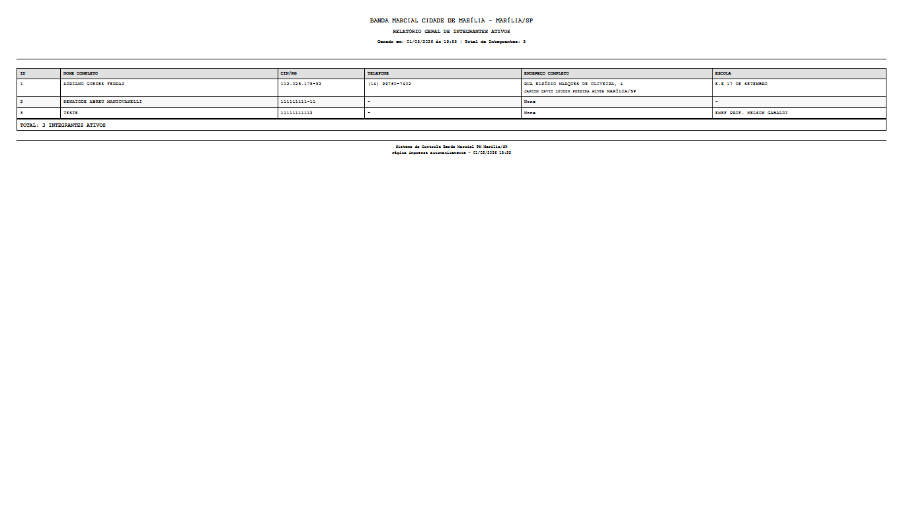

# Manual do Usuário - Sistema BMCM

## Sistema de Gestão da Banda Marcial Municipal de Marília - SP

---
> 📘 Este manual foi desenvolvido para orientar o uso do Sistema BMCM.
>
> Para dúvidas técnicas, entre em contato com o administrador.

## 1. Introdução

### 1.1 Objetivo do Sistema
O Sistema BMCM é uma aplicação web desenvolvida para apoiar a gestão administrativa da Banda Marcial Municipal de Marília - SP. O sistema permite o cadastro, consulta, atualização e acompanhamento de integrantes da banda, com foco em organização administrativa e continuidade histórica dos dados.

### 1.2 Público-Alvo
- Administradores do sistema
- Profissionais responsáveis pela gestão
- Coordenadores da banda

### 1.3 Requisitos de Acesso
- Navegador web moderno (Chrome, Firefox, Edge, Safari)
- Conexão com o servidor onde o sistema está hospedado
- Credenciais de acesso (usuário e senha)

---

## 2. Guia Rápido 

Siga os passos abaixo para começar a utilizar o sistema rapidamente:

1. Acesse o sistema pelo navegador
2. Informe seu usuário e senha
3. Após o login, acesse o menu superior e clique em **Integrantes**
4. Clique em **"Novo Integrante"**
5. Preencha os dados obrigatórios
6. Clique em **"Salvar"**

✔ Pronto! O aluno já estará cadastrado no sistema.

> Dica: Utilize o menu superior para navegar entre as funcionalidades.
> 
## 3. Acesso ao Sistema

### 3.1 Tela de Login
Ao acessar o sistema, o usuário será direcionado para a tela de login.

**Campos:**
- **Usuário**: Campo obrigatório para inserção do nome de usuário
- **Senha**: Campo obrigatório para inserção da senha

**Botão "Entrar"**: Realiza a autenticação no sistema

### 3.2 Primeiro Acesso
No primeiro acesso, o sistema solicitará a alteração da senha padrão. O usuário deverá:
1. Inserir a senha atual (fornecida pelo administrador)
2. Criar uma nova senha com no mínimo 6 caracteres
3. Confirmar a nova senha

### 3.3 Recuperação de Senha
Em caso de esquecimento de senha, entre em contato com o administrador do sistema.

---

## 4. Dashboard (Painel Principal)

### 4.1 Visão Geral
Após o login, o usuário acessa o dashboard que apresenta estatísticas gerais do sistema:

Estatísticas apresentadas:
- Total de alunos cadastrados
- Alunos ativos
- Total de escolas cadastradas
- Instrumentos ativos
- Usuários ativos
- Usuários administradores

### 4.2 Menu de Navegação
O menu principal está disponível na barra superior ou lateral e permite acesso a todas as funcionalidades do sistema.

---

## 4. Gestão de Usuários (Administrador)

### 4.1 Listar Usuários
Acesse o menu superior e clique em **Usuários** para visualizar todos os usuários cadastrados no sistema.

**Informações exibidas:**
- Nome de usuário
- Status (ativo/inativo)
- Tipo (administrador ou não)
- Última alteração de senha

### 4.2 Criar Novo Usuário
1. Acesse o menu superior e clique em **Usuários**
2. Clique em **"Novo Usuário"**
3. Preencha os campos:

- **Usuário**: Nome de login (único)
- **Senha**: Senha inicial
- **Administrador**: Marque se o usuário terá acesso administrativo
4. Clique em **"Salvar"**

### 4.3 Editar Usuário
1. Acesse o menu superior e clique em **Usuários**
2. Clique no botão de edição ao lado do usuário desejado
3. Altere os dados necessários
4. Clique em **"Salvar"**

**Nota**: O nome de usuário não pode ser alterado após a criação.

### 4.4 Alterar Senha de Usuário
1. Acesse o menu superior e clique em **Usuários**
2. Clique em **"Resetar Senha"** ao lado do usuário
3. A senha será redefinida para a senha padrão do sistema

### 4.5 Ativar/Desativar Usuário
1. Acesse o menu superior e clique em **Usuários**
2. Clique no botão de alternância ao lado do usuário
3. O usuário será ativado ou bloqueado imediatamente

### 4.6 Excluir Usuário
1. Acesse o menu superior e clique em **Usuários**
2. Clique no botão de exclusão ao lado do usuário
3. Confirme a exclusão na mensagem apresentada

**Nota**: O usuário "admin" não pode ser excluído ou alterado por outros usuários.

---

## 5. Gestão de Alunos/Integrantes

### 5.1 Listar Alunos
Acesse o menu superior e clique em **Integrantes** para visualizar todos os alunos cadastrados.

**Filtros disponíveis:**
- Busca por nome
- Filtrar por status (ativos/inativos)

**Informações exibidas:**
- Nome do aluno
- Data de nascimento
- Escola
- Status (ativo/inativo)
- Ações (editar, visualizar, excluir)

### 5.2 Cadastrar Novo Aluno
1. Acesse o menu superior e clique em **Integrantes**
2. Clique em **"Novo Aluno"**
3. Preencha os dados em abas:

**Aba Dados Pessoais:**
- Nome completo (obrigatório)
- Data de nascimento
- Naturalidade
- CPF/RG
- E-mail
- Telefone

**Aba Endereço:**
- CEP (busca automática)
- Endereço
- Número
- Complemento
- Bairro
- Cidade
- Estado

**Aba Informações da Banda:**
- Função na banda (maestro, aluno, etc.)
- Foto do aluno

**Aba Escola:**
- Selecione a escola
- Ano letivo

**Aba Instrumento:**
- Selecione o instrumento(s) utilizado(s)

**Aba Responsáveis (para menores):**
- Nome do responsável
- Parentesco
- Telefone
- E-mail

**Aba Autorizações:**
- Termo de autorização de foto (obrigatório para menores)

4. Clique em **"Salvar"**
   

### 5.3  Cadastro de Aluno Menor de Idade

Para alunos menores de 18 anos:

1. Preencha os dados normalmente
2. Vá até a aba **Responsáveis**
3. Cadastre pelo menos um responsável
4. Vá até a aba **Autorizações**
5. Marque o consentimento de imagem
6. Realize a assinatura digital

⚠ Obrigatório para salvar com foto

### 5.4 Editar Aluno
1. Acesse o menu superior e clique em **Integrantes**
2. Clique no botão de edição ao lado do aluno desejado
3. Altere os dados necessários
4. Clique em **"Salvar"**

### 5.5 Visualizar Aluno (Relatório Individual)
1. Acesse o menu superior e clique em **Integrantes**
2. Clique no botão de visualização ao lado do aluno
3. O sistema exibirá um relatório completo com todos os dados

### 5.6 Ativar/Desativar Aluno
1. Acesse o menu superior e clique em **Integrantes**
2. Clique no botão de alternância ao lado do aluno
3. O aluno será marcado como inativo (não excluído)

**Nota**: O sistema mantém o histórico dos alunos inativos ao invés de excluí-los.

### 5.7 Excluir Aluno
1. Acesse o menu superior e clique em **Integrantes**
2. Clique no botão de exclusão ao lado do aluno
3. Confirme a exclusão na mensagem apresentada

---

## 6. Gestão de Escolas

### 6.1 Listar Escolas
Acesse o dashboard e clique em **Escolas** para visualizar todas as escolas cadastradas.

**Informações exibidas:**
- Nome da escola
- Endereço
- Quantidade de alunos vinculados
- Ações (editar, excluir)

### 6.2 Cadastrar Nova Escola
1. Acesse o dashboard e clique em **Escolas**
2. Clique em **"Nova Escola"**
3. Preencha os campos:

- **Nome**: Nome da escola (obrigatório)
- **Endereço**: Endereço completo
4. Clique em **"Salvar"**

### 6.3 Editar Escola
1. Acesse o dashboard e clique em **Escolas**
2. Clique no botão de edição ao lado da escola desejada
3. Altere os dados necessários
4. Clique em **"Salvar"**

### 6.4 Excluir Escola
1. Acesse o dashboard e clique em **Escolas**
2. Clique no botão de exclusão ao lado da escola
3. Confirme a exclusão

**Nota**: Só será possível excluir escolas que não tenham alunos vinculados.

### 6.5 Relatório de Escolas
Na tela de Escolas, clique em **Relatório** para visualizar um relatório com todas as escolas e seus respectivos alunos vinculados.

---

## 7. Gestão de Instrumentos

### 7.1 Listar Instrumentos
Clique em **Instrumentos** no menu superior para visualizar todos os instrumentos cadastrados.

**Informações exibidas:**
- Nome do instrumento
- Tipo
- Naipe
- Status (ativo/inativo)
- Ações (editar, ativar/inativar)

### 7.2 Cadastrar Novo Instrumento
1. Clique em **Instrumentos** no menu superior
2. Clique em **"Novo Instrumento"**
3. Preencha os campos:

- **Nome**: Nome do instrumento (obrigatório)
- **Tipo**: Categoria do instrumento
- **Naipe**: Seção da banda
- **Descrição**: Descrição adicional
4. Clique em **"Salvar"**

### 7.3 Editar Instrumento
1. Clique em **Instrumentos** no menu superior
2. Clique no botão de edição ao lado do instrumento desejado
3. Altere os dados necessários
4. Clique em **"Salvar"**

### 7.4 Ativar/Desativar Instrumento
1. Clique em **Instrumentos** no menu superior
2. Clique no botão de alternância ao lado do instrumento
3. O instrumento será ativado ou inativado

---

## 8. Tipos e Naipes

### 8.1 Tipos de Instrumento
Gerencie as categorias de instrumentos (ex: cordas, sopros, percussão).

### 8.2 Naipes
Gerencie as seções da banda (ex: metais, madeiras, percussão).

---

## 9. Relatórios

### 9.1 Relatório Geral de Alunos
Acesse para visualizar todos os alunos cadastrados com filtros por:
- Escola
- Status
- Função na banda

### 9.2 Relatório Individual de Aluno
Acesse através da visualização de cada aluno para obter um relatório detalhado.

### 9.3 Relatório de Escolas
Acesse para visualizar todas as escolas e seus alunos vinculados.

---

## 10. Backup do Sistema

### 10.1 Criar Backup
1. No menu do usuário, no canto superior direito, selecione **Backup do Banco**
2. Clique em **"Criar Backup Agora"**
3. O sistema gerará uma cópia do banco de dados

### 10.2 Restaurar Backup
1. No menu do usuário, selecione **Backup do Banco**
2. Selecione o backup desejado da lista
3. Clique em **"Restaurar"**
4. Confirme a operação

**Aviso**: A restauração substituirá todos os dados atuais. Faça um backup antes se necessário.

### 10.3 Excluir Backup
1. No menu do usuário, selecione **Backup do Banco**
2. Selecione o backup desejado
3. Clique em **"Excluir"**

---

## 11. Alteração de Senha

### 11.1 Alterar Própria Senha
1. Clique no seu nome de usuário no menu superior
2. Selecione **"Alterar Senha"**
3. Preencha:

- Senha atual
- Nova senha
- Confirme a nova senha
1. Clique em **"Salvar"**

---

## 12. Logout

### 12.1 Sair do Sistema
1. Clique no seu nome de usuário no menu superior
2. Selecione **"Sair"**

---

## 13. Perfis de Usuário

### 13.1 Administrador
Acesso completo a todas as funcionalidades:
- Gestão de usuários
- Gestão de alunos
- Gestão de escolas
- Gestão de instrumentos
- Relatórios
- Backup
- Configurações do sistema

### 13.2 Profissional
Acesso às funcionalidades de gestão:
- Gestão de alunos
- Gestão de escolas
- Gestão de instrumentos
- Relatórios

### 13.3 Usuário Comum
Acesso básico:
- Visualização de dados
- Relatórios

---

## 14. Dicas de Segurança

1. **Senhas**: Use senhas fortes com no mínimo 6 caracteres
2. **Logout**: Sempre saia do sistema após o uso
3. **Compartilhamento**: Não compartilhe suas credenciais
4. **Bloqueio**: O sistema bloqueia o usuário após 3 tentativas de login incorretas por 12 horas
### 14.1 Boas Práticas de Segurança

- Utilize senhas com:
  - mínimo de 8 caracteres
  - letras maiúsculas e minúsculas
  - números e símbolos

- Não compartilhe suas credenciais

- Evite acessar o sistema em redes públicas

- Sempre realize logout após o uso

- Altere sua senha periodicamente
---

## 15. Solução de Problemas

### 15.1 Esqueci minha senha
Entre em contato com o administrador do sistema para resetar sua senha.

### 15.2 Usuário bloqueado
O sistema bloqueia automaticamente após 3 tentativas incorretas. Aguarde 12 horas ou entre em contato com o administrador.

### 15.3 Não consigo acessar uma funcionalidade
Verifique se seu perfil de usuário tem permissão para acessar aquela funcionalidade. Entre em contato com o administrador se necessário.

### 15.4 Dados não aparecem
Verifique se você tem permissão de acesso. Alguns dados podem estar filtrados por perfil.

---
## 16. Problemas Comuns e Soluções

### ❌ Não consigo salvar o aluno
- Verifique campos obrigatórios
- Confirme autorização de menor (se aplicável)

---

### ❌ CEP não preenche automaticamente
- Verifique conexão com internet
- Preencha manualmente os dados

---

### ❌ Usuário bloqueado
- O sistema bloqueia após 3 tentativas
- Aguarde 12 horas ou solicite desbloqueio

---

### ❌ Dados não aparecem
- Verifique filtros ativos
- Confirme permissões do usuário

---

### ❌ Não consigo excluir escola
- Pode haver alunos vinculados
- Remova vínculos antes de excluir

---

## 17. Contato e Suporte

Para dúvidas ou problemas técnicos, entre em contato com o administrador do sistema.

---

**Versão do Manual**: 1.0
**Sistema**: Sistema BMCM - Banda Marcial Municipal de Marília
**Data de Criação**: 2026

---

