# Manual do Usuário - Sistema BMCM

## Sistema de Gestão da Banda Marcial Municipal de Marília - SP

---
> 📘 Este manual foi desenvolvido para orientar o uso do Sistema BMCM.
>
> Para dúvidas técnicas, entre em contato com o administrador.

## 1. Introdução

### 1.1 Objetivo do Sistema
O Sistema BMCM é uma aplicação web desenvolvida para apoiar a gestão administrativa da Banda Marcial Municipal de Marília - SP. O sistema permite o cadastro, consulta, atualização e acompanhamento de integrantes da banda, com foco em organização administrativa e continuidade histórica dos dados.

### 1.2 Público-Alvo
- Administradores do sistema
- Profissionais responsáveis pela gestão
- Coordenadores da banda

### 1.3 Requisitos de Acesso
- Navegador web moderno (Chrome, Firefox, Edge, Safari)
- Conexão com o servidor onde o sistema está hospedado
- Credenciais de acesso (usuário e senha)
- Arquivo local `.env` configurado com as variáveis de ambiente do sistema e do Google OAuth, quando a integração do Google estiver habilitada

---

## 2. Guia Rápido

Siga os passos abaixo para começar a utilizar o sistema rapidamente:

1. Acesse o sistema pelo navegador
2. Informe seu usuário e senha
3. Após o login, acesse o menu superior e clique em **Integrantes**
4. Clique em **"Novo Integrante"**
5. Preencha os dados obrigatórios
6. Clique em **"Salvar"**

✔ Pronto! O aluno já estará cadastrado no sistema.

> Dica: Utilize o menu superior para navegar entre as funcionalidades.
>
## 3. Acesso ao Sistema

### 3.1 Tela de Login
Ao acessar o sistema, o usuário será direcionado para a tela de login.

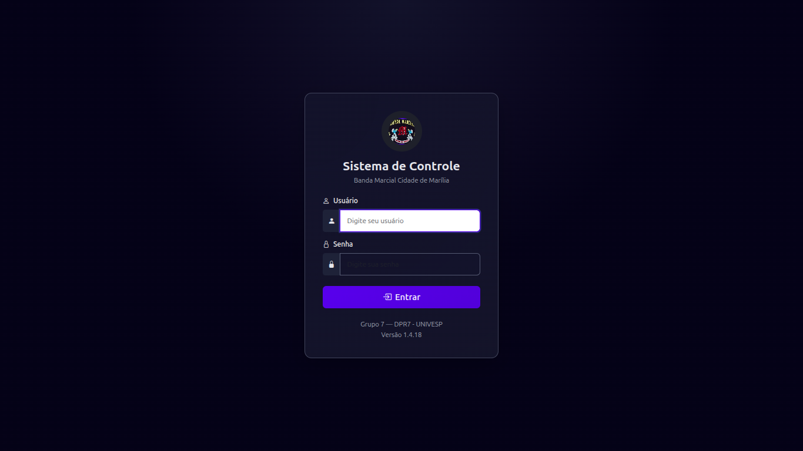

**Campos:**
- **Usuário**: Campo obrigatório para inserção do nome de usuário
- **Senha**: Campo obrigatório para inserção da senha

**Botão "Entrar"**: Realiza a autenticação no sistema

### 3.2 Primeiro Acesso
No primeiro acesso, o sistema solicitará a alteração da senha padrão. O usuário deverá:
1. Inserir a senha atual (fornecida pelo administrador)
2. Criar uma nova senha com no mínimo 6 caracteres
3. Confirmar a nova senha

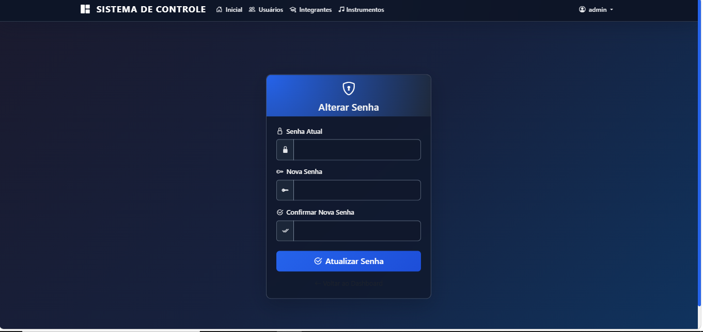

### 3.3 Configuração do arquivo `.env`
Antes de utilizar integrações com o Google, o administrador deve configurar o arquivo `.env` do projeto com as credenciais do Google OAuth 2.0 e a chave secreta da aplicação.

Variáveis principais:
- `GOOGLE_OAUTH_CLIENT_ID`
- `GOOGLE_OAUTH_CLIENT_SECRET`
- `GOOGLE_OAUTH_REDIRECT_URI`
- `GOOGLE_OAUTH_SCOPES`
- `SECRET_KEY`
- `BACKUP_PASSWORD` (opcional; senha de backup com pelo menos 16 caracteres)

O arquivo `.env` deve permanecer fora do Git e não deve ser enviado para repositórios públicos.

A senha do backup também pode ser registrada na guia **Configurações > Sistema/Manutenção**, após informar a senha atual do administrador. A senha salva no `.env` pode ser revelada somente após nova reautenticação administrativa. Se já existir uma chave local ou backups protegidos, a interface só aceita registrar a mesma chave para preservar a restauração.

### 3.4 OAuth do Google e Google Workspace
Na área de configurações administrativas, o administrador pode autorizar os escopos Gmail, Google Calendar e Google Drive solicitados pelo sistema. O escopo Drive é `drive.file` e limita o acesso aos arquivos e pastas criados pela aplicação.

Após a autorização, o sistema salva o token localmente em `instance/google_oauth_token.json`. O token é usado para enviar mensagens pelo Gmail, sincronizar ensaios, eventos e atividades avulsas para o Google Calendar e enviar backups ao Google Drive, conforme os escopos autorizados.

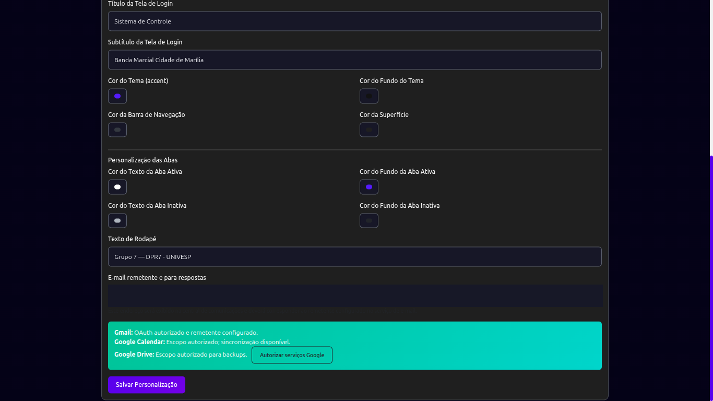

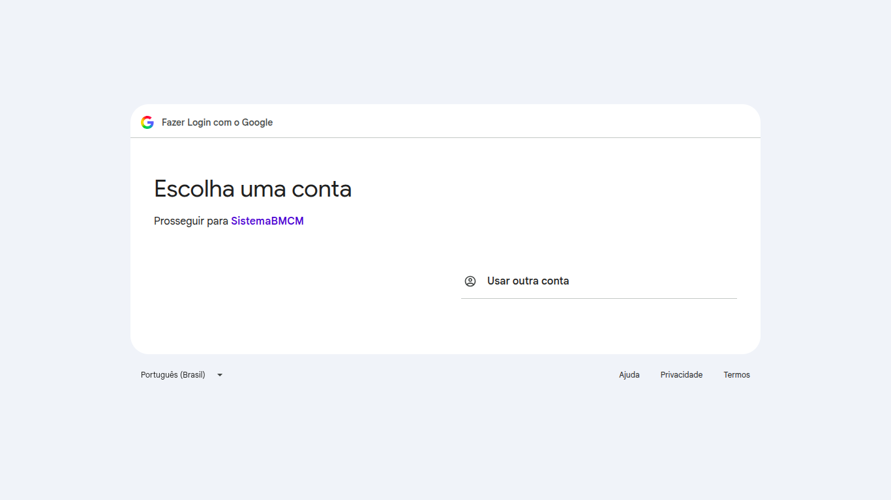

### 3.5 Recuperação de Senha
Em caso de esquecimento de senha, entre em contato com o administrador do sistema.

---

## 4. Dashboard (Painel Principal)

### 4.1 Visão Geral
Após o login, o usuário acessa o dashboard que apresenta estatísticas gerais do sistema:

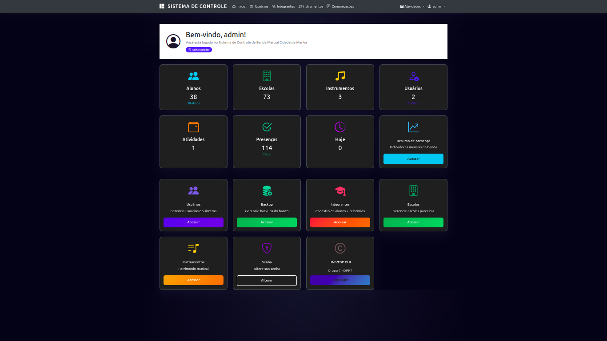

Estatísticas apresentadas:
- Total de alunos cadastrados
- Alunos ativos
- Total de escolas cadastradas
- Instrumentos ativos
- Usuários ativos
- Usuários administradores
- Atividades registradas
- Registros de presença
- Atividades e presenças do dia

### 4.2 Menu de Navegação
O menu principal está disponível na barra superior ou lateral e permite acesso a todas as funcionalidades do sistema.

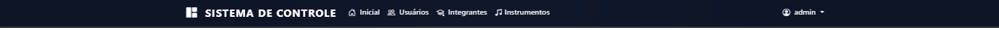

---

## 4. Gestão de Usuários (Administrador)

### 4.1 Listar Usuários
Acesse o menu superior e clique em **Usuários** para visualizar todos os usuários cadastrados no sistema.

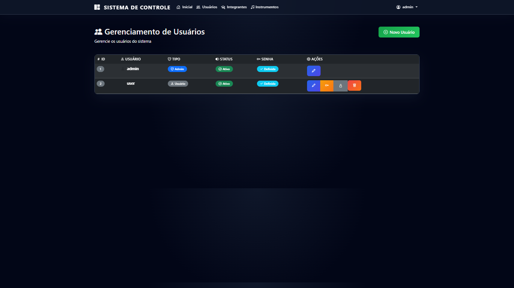

**Informações exibidas:**
- Nome de usuário
- Status (ativo/inativo)
- Tipo (administrador ou não)
- Última alteração de senha

### 4.2 Criar Novo Usuário
1. Acesse o menu superior e clique em **Usuários**
2. Clique em **"Novo Usuário"**
3. Preencha os campos:

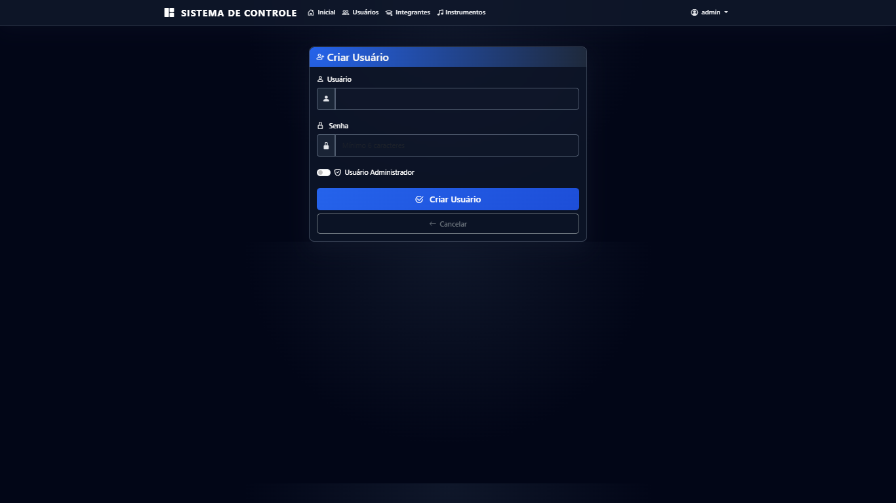

- **Usuário**: Nome de login (único)
- **Senha**: Senha inicial
- **Administrador**: Marque se o usuário terá acesso administrativo
4. Clique em **"Salvar"**

### 4.3 Editar Usuário
1. Acesse o menu superior e clique em **Usuários**
2. Clique no botão de edição ao lado do usuário desejado
3. Altere os dados necessários
4. Clique em **"Salvar"**

**Nota**: O nome de usuário não pode ser alterado após a criação.

### 4.4 Alterar Senha de Usuário
1. Acesse o menu superior e clique em **Usuários**
2. Clique em **"Resetar Senha"** ao lado do usuário
3. A senha será redefinida para a senha padrão do sistema

### 4.5 Ativar/Desativar Usuário
1. Acesse o menu superior e clique em **Usuários**
2. Clique no botão de alternância ao lado do usuário
3. O usuário será ativado ou bloqueado imediatamente

### 4.6 Excluir Usuário
1. Acesse o menu superior e clique em **Usuários**
2. Clique no botão de exclusão ao lado do usuário
3. Confirme a exclusão na mensagem apresentada

**Nota**: O usuário "admin" não pode ser excluído ou alterado por outros usuários.

---

## 5. Gestão de Alunos/Integrantes

### 5.1 Listar Alunos
Acesse o menu superior e clique em **Integrantes** para visualizar todos os alunos cadastrados.

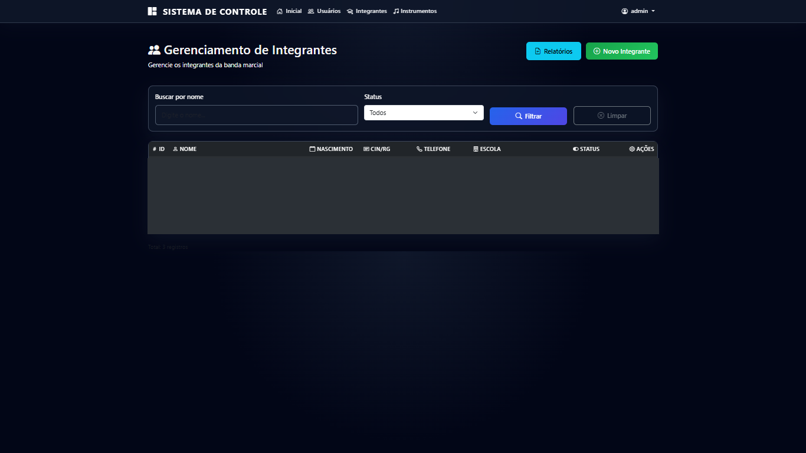

**Filtros disponíveis:**
- Busca por nome
- Filtrar por status (ativos/inativos)

**Informações exibidas:**
- Nome do aluno
- Data de nascimento
- Escola
- Status (ativo/inativo)
- Ações (editar, visualizar, excluir)

### 5.2 Cadastrar Novo Aluno
1. Acesse o menu superior e clique em **Integrantes**
2. Clique em **"Novo Aluno"**
3. Preencha os dados em abas:

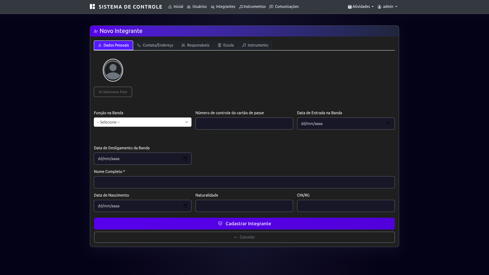

**Aba Dados Pessoais:**
- Nome completo (obrigatório)
- Data de nascimento
- Naturalidade
- CPF/RG
- E-mail
- Telefone

**Aba Endereço:**
- CEP (busca automática)
- Endereço
- Número
- Complemento
- Bairro
- Cidade
- Estado

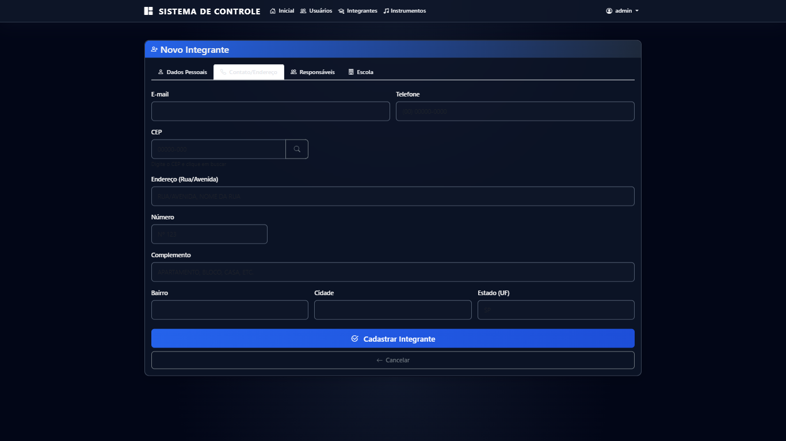

**Aba Informações da Banda:**
- Função na banda (maestro, aluno, etc.)
- Foto do aluno

**Aba Escola:**
- Selecione a escola
- Ano letivo

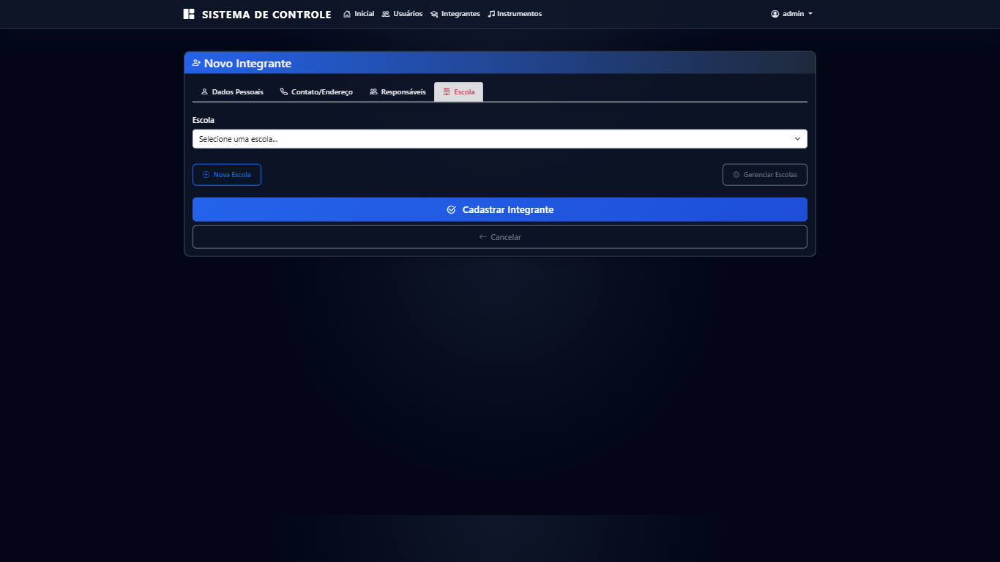

**Aba Instrumento:**
- Selecione o instrumento atualmente associado ao integrante
- Informe observações, quando necessário

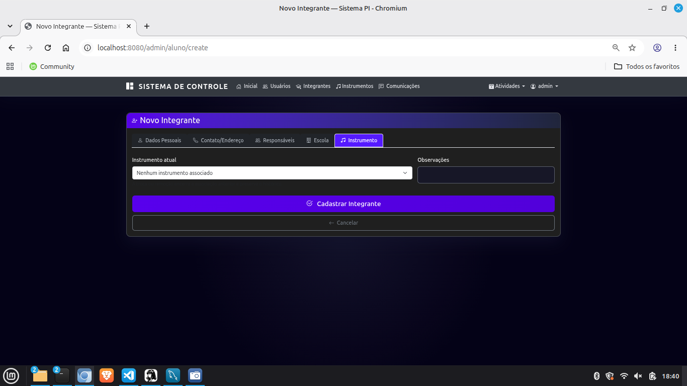

Ao trocar o instrumento, a associação anterior recebe uma data de devolução e permanece no histórico. Instrumentos inativos não podem ser associados a novos integrantes.

**Aba Responsáveis (para menores):**
- Nome do responsável
- Parentesco
- Telefone
- E-mail

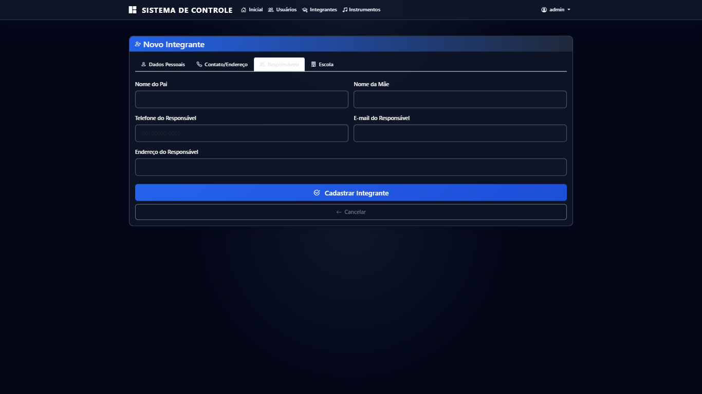

**Aba Autorizações:**
- Termo de autorização de foto (obrigatório para menores)

4. Clique em **"Salvar"**

### 5.3  Cadastro de Aluno Menor de Idade

Para alunos menores de 18 anos:

1. Preencha os dados normalmente
2. Vá até a aba **Responsáveis**
3. Cadastre pelo menos um responsável
4. Vá até a aba **Autorizações**
5. Marque o consentimento de imagem
6. Realize a assinatura digital

⚠ Obrigatório para salvar com foto

### 5.4 Editar Aluno
1. Acesse o menu superior e clique em **Integrantes**
2. Clique no botão de edição ao lado do aluno desejado
3. Altere os dados necessários
4. Clique em **"Salvar"**

### 5.5 Visualizar Aluno (Relatório Individual)
1. Acesse o menu superior e clique em **Integrantes**
2. Clique no botão de visualização ao lado do aluno
3. O sistema exibirá um relatório completo com todos os dados

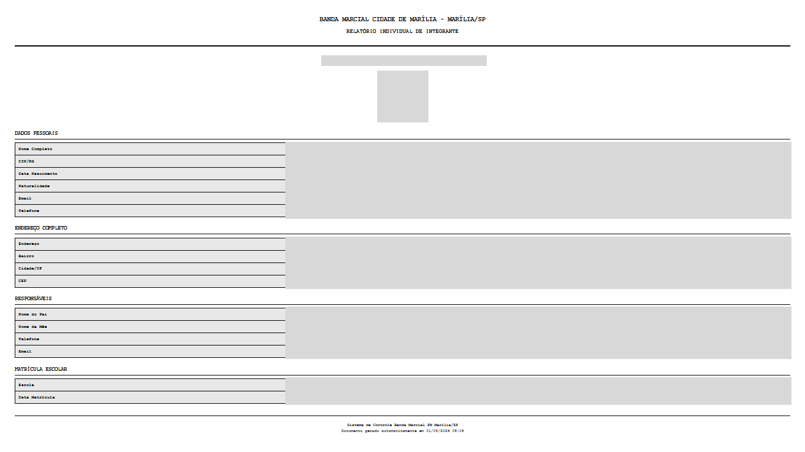

### 5.6 Ativar/Desativar Aluno
1. Acesse o menu superior e clique em **Integrantes**
2. Clique no botão de alternância ao lado do aluno
3. O aluno será marcado como inativo (não excluído)

**Nota**: O sistema mantém o histórico dos alunos inativos ao invés de excluí-los.

### 5.7 Excluir Aluno
1. Acesse o menu superior e clique em **Integrantes**
2. Clique no botão de exclusão ao lado do aluno
3. Confirme a exclusão na mensagem apresentada

---

## 6. Gestão de Escolas

### 6.1 Listar Escolas
Acesse o dashboard e clique em **Escolas** para visualizar todas as escolas cadastradas.

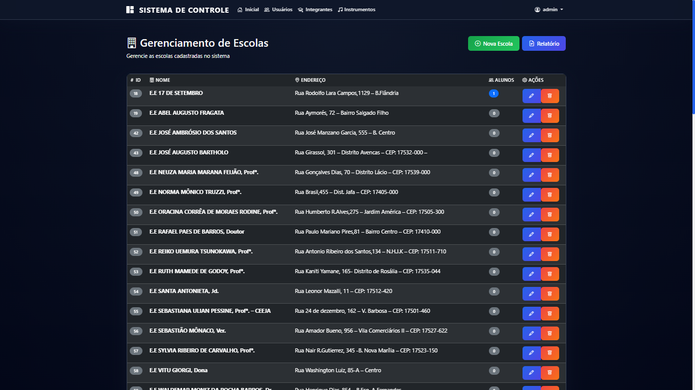

**Informações exibidas:**
- Nome da escola
- Endereço
- Quantidade de alunos vinculados
- Ações (editar, excluir)

### 6.2 Cadastrar Nova Escola
1. Acesse o dashboard e clique em **Escolas**
2. Clique em **"Nova Escola"**
3. Preencha os campos:

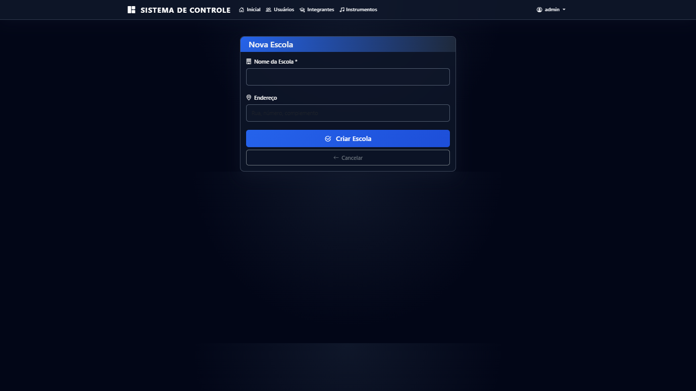

- **Nome**: Nome da escola (obrigatório)
- **Endereço**: Endereço completo
4. Clique em **"Salvar"**

### 6.3 Editar Escola
1. Acesse o dashboard e clique em **Escolas**
2. Clique no botão de edição ao lado da escola desejada
3. Altere os dados necessários
4. Clique em **"Salvar"**

### 6.4 Excluir Escola
1. Acesse o dashboard e clique em **Escolas**
2. Clique no botão de exclusão ao lado da escola
3. Confirme a exclusão

**Nota**: Só será possível excluir escolas que não tenham alunos vinculados.

### 6.5 Relatório de Escolas
Na tela de Escolas, clique em **Relatório** para visualizar um relatório com todas as escolas e seus respectivos alunos vinculados.

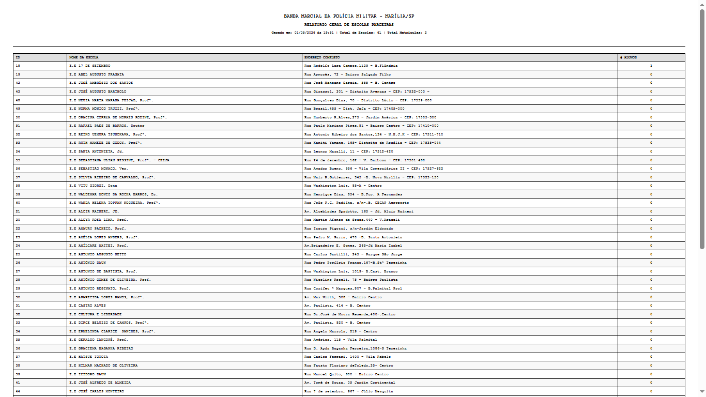

---

## 7. Gestão de Instrumentos

### 7.1 Listar Instrumentos
Clique em **Instrumentos** no menu superior para visualizar todos os instrumentos cadastrados.

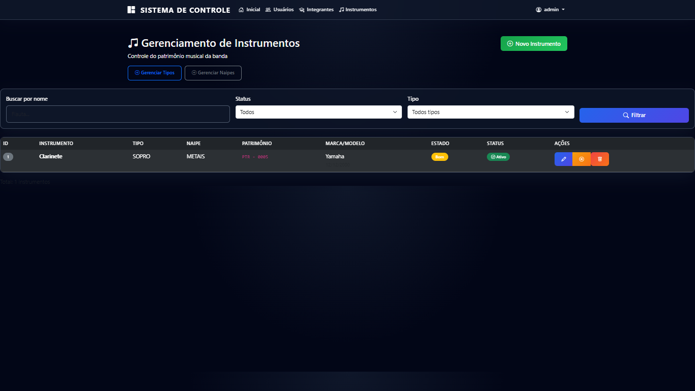

**Informações exibidas:**
- Nome do instrumento
- Tipo
- Naipe
- Status (ativo/inativo)
- Ações (editar, ativar/inativar)

### 7.2 Cadastrar Novo Instrumento
1. Clique em **Instrumentos** no menu superior
2. Clique em **"Novo Instrumento"**
3. Preencha os campos:

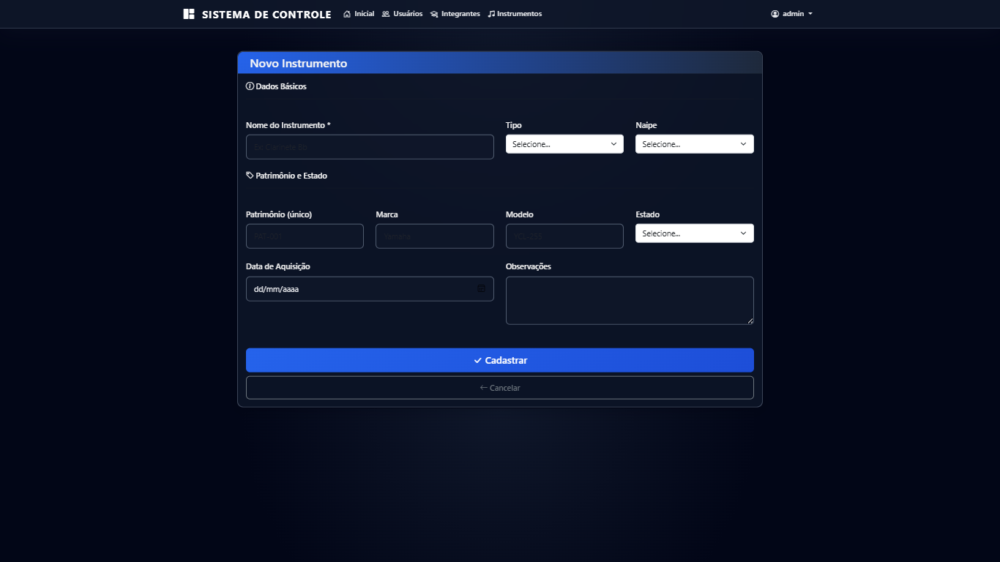

- **Nome**: Nome do instrumento (obrigatório)
- **Tipo**: Categoria do instrumento
- **Naipe**: Seção da banda
- **Descrição**: Descrição adicional
4. Clique em **"Salvar"**

### 7.3 Editar Instrumento
1. Clique em **Instrumentos** no menu superior
2. Clique no botão de edição ao lado do instrumento desejado
3. Altere os dados necessários
4. Clique em **"Salvar"**

### 7.4 Ativar/Desativar Instrumento
1. Clique em **Instrumentos** no menu superior
2. Clique no botão de alternância ao lado do instrumento
3. O instrumento será ativado ou inativado

---

## 8. Tipos e Naipes

### 8.1 Tipos de Instrumento
Gerencie as categorias de instrumentos (ex: cordas, sopros, percussão).

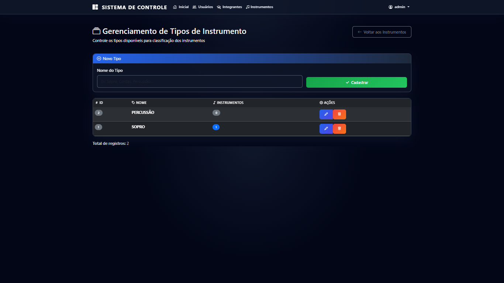

### 8.2 Naipes
Gerencie as seções da banda (ex: metais, madeiras, percussão).

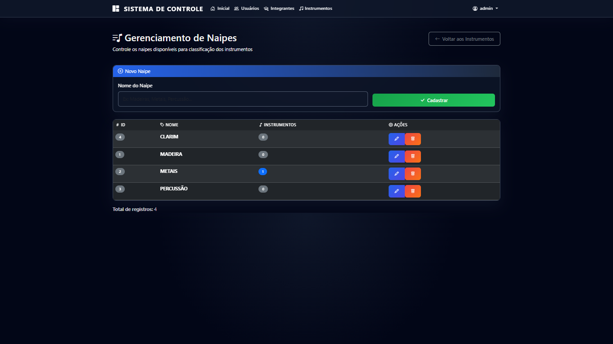

---

## 9. Presença, Ensaios e Eventos

### Calendário BMCM

No menu **Atividades**, acesse **Calendário BMCM** para visualizar os ensaios, eventos e atividades avulsas cadastrados por mês. Use as setas, o seletor de mês ou **Hoje** para navegar; selecione um dia para consultar seus registros.

Use os filtros para pesquisar por título, local ou status e restringir a consulta por tipo de registro. A visualização **Mês** exibe a grade tradicional; a visualização **Agenda** lista os registros em ordem cronológica. Os indicadores mostram o total de registros, quantos possuem chamada, quantos estão pendentes e o total de presenças.

Para cada registro, use **Chamada** para lançar ou consultar presença e, quando disponível, **Relatório**. **Relatório diário** abre a folha consolidada da data. Os botões de criação do dia abrem o formulário correspondente com a data selecionada já preenchida.

O calendário BMCM é independente do Google Calendar. A grade não representa horário de funcionamento da Banda e não presume horário para atividades sem essa informação. A sincronização Google é manual e opcional em cada registro.

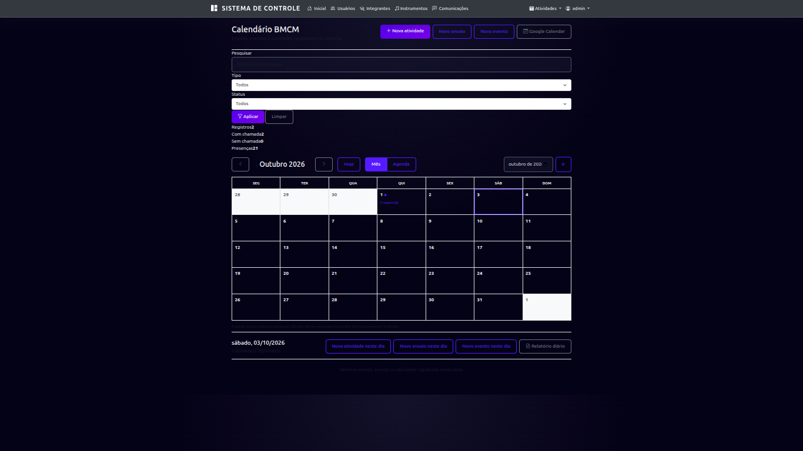

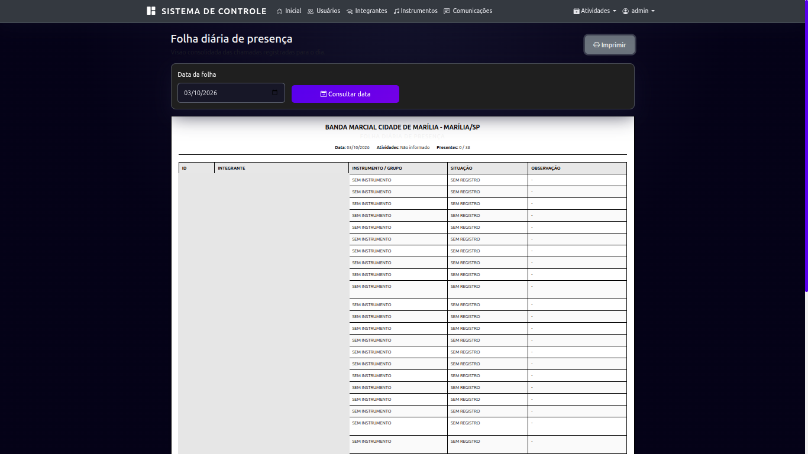

### 9.1 Criar um Ensaio

1. No menu superior, abra **Atividades** e clique em **Ensaios**
2. Clique em **Novo ensaio**
3. Informe:
  - título;
  - data;
  - horário;
  - local;
  - observações;
  - status.
4. Clique em **Criar e registrar chamada**

Após o cadastro, o sistema abrirá automaticamente a folha de chamada.

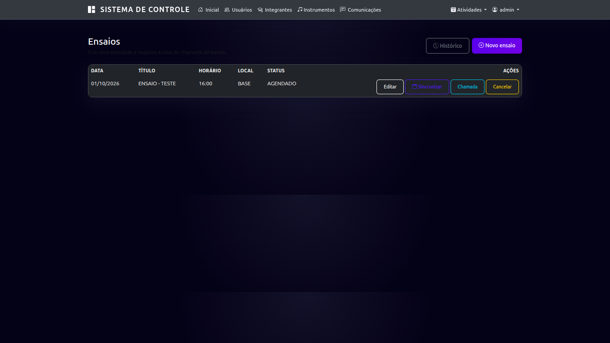

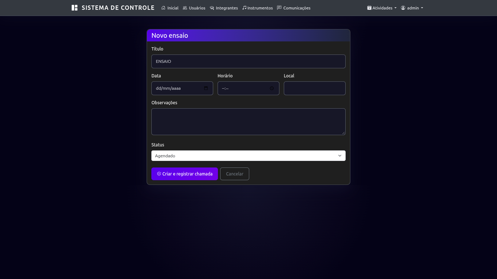

### 9.2 Registrar Presença em um Ensaio

Na folha de chamada, os integrantes ativos são agrupados pelo instrumento atualmente associado. Para cada integrante, marque uma situação:

- **Presente**;
- **Ausente**;
- **Justificado**.

Clique em **Salvar presença** para registrar ou atualizar a chamada. O usuário responsável e o horário do registro são armazenados para auditoria.

O botão **Imprimir** gera uma versão adequada para impressão e conferência durante o ensaio.

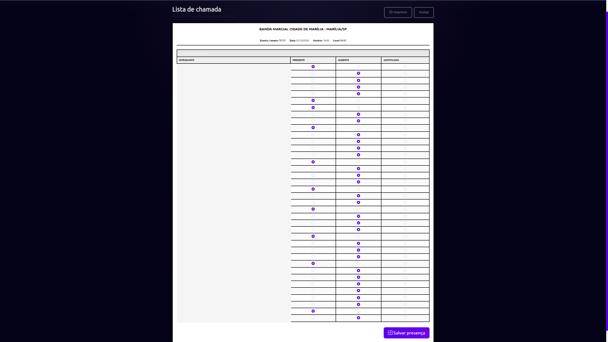

### 9.3 Editar ou Cancelar um Ensaio

Na tela **Ensaios**, use:

- **Editar** para alterar título, data, horário, local, observações ou status;
- **Cancelar** para alterar o status para cancelado.

O cancelamento não exclui o ensaio nem suas presenças, preservando o histórico administrativo.

Na listagem de ensaios, use **Sincronizar** para publicar o ensaio no Google Calendar. Após a primeira sincronização, edições e cancelamentos feitos no BMCM tentam atualizar o evento vinculado. Se a API estiver indisponível ou a autorização tiver expirado, o ensaio permanece salvo no BMCM e uma mensagem informa a falha. Ensaios com horário são enviados com duração padrão de uma hora; sem horário, são enviados como eventos de dia inteiro. A sincronização depende da autorização do escopo Calendar.

### 9.4 Criar um Evento ou Apresentação

1. No menu superior, clique em **Eventos**
2. Clique em **Novo evento**
3. Informe:
  - nome do evento;
  - data;
  - cidade ou local;
  - status;
  - responsável;
  - telefone.
4. Clique em **Criar e registrar chamada**

Os status disponíveis são **A confirmar**, **Confirmado** e **Cancelado**.

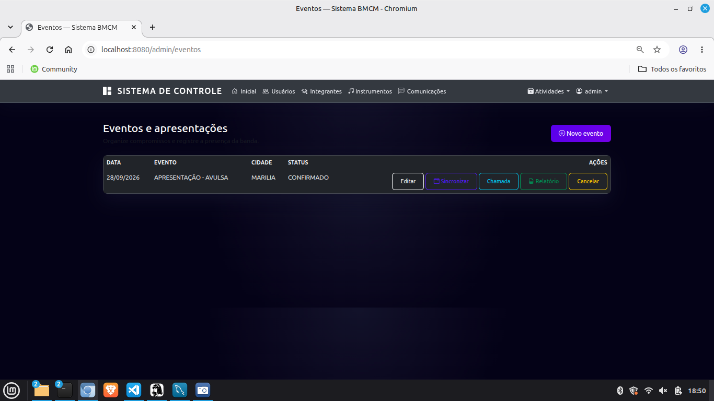

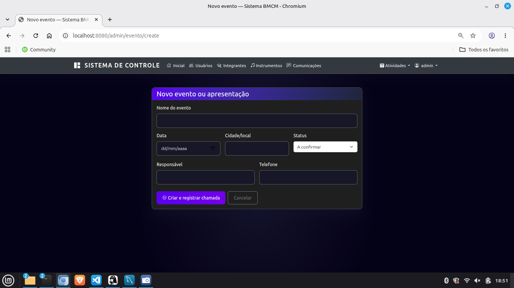

### 9.5 Registrar Presença em Evento

Na listagem de **Eventos**, clique em **Chamada**. A folha funciona da mesma forma que a folha de ensaio, agrupando integrantes por instrumento e permitindo marcar presença, ausência ou justificativa.

### 9.6 Editar ou Cancelar um Evento

Na tela **Eventos**, use **Editar** para atualizar os dados do evento. Use **Cancelar** quando a apresentação não for realizada.

O cancelamento é lógico: os dados do evento e os registros de presença permanecem disponíveis para consulta.

Na listagem de eventos, use **Sincronizar** para publicar o evento no Google Calendar como evento de dia inteiro. Depois da primeira sincronização, edições e cancelamentos feitos no BMCM tentam atualizar o evento vinculado. Se a API estiver indisponível ou a autorização tiver expirado, o evento permanece salvo no BMCM e uma mensagem informa a falha. Alterações feitas diretamente no Google Calendar não são importadas para o BMCM.

### 9.7 Publicar uma Atividade no Google Calendar

1. Acesse **Atividades** e crie o treinamento, apresentação ou outra atividade.
2. Na listagem, clique em **Sincronizar Calendar**. A sincronização é manual e exige que o escopo Google Calendar esteja autorizado.
3. Se a atividade já tiver sido sincronizada, use **Atualizar calendário** para atualizar o mesmo evento remoto.

Quando houver início e fim, ambos são usados no evento. Com apenas horário inicial, o sistema considera uma hora de duração. Sem horário, a atividade é publicada como evento de dia inteiro. Área, responsável, tipo e observações são incluídos na descrição. O BMCM continua sendo o registro oficial; alterações feitas diretamente no Google Calendar não são importadas.

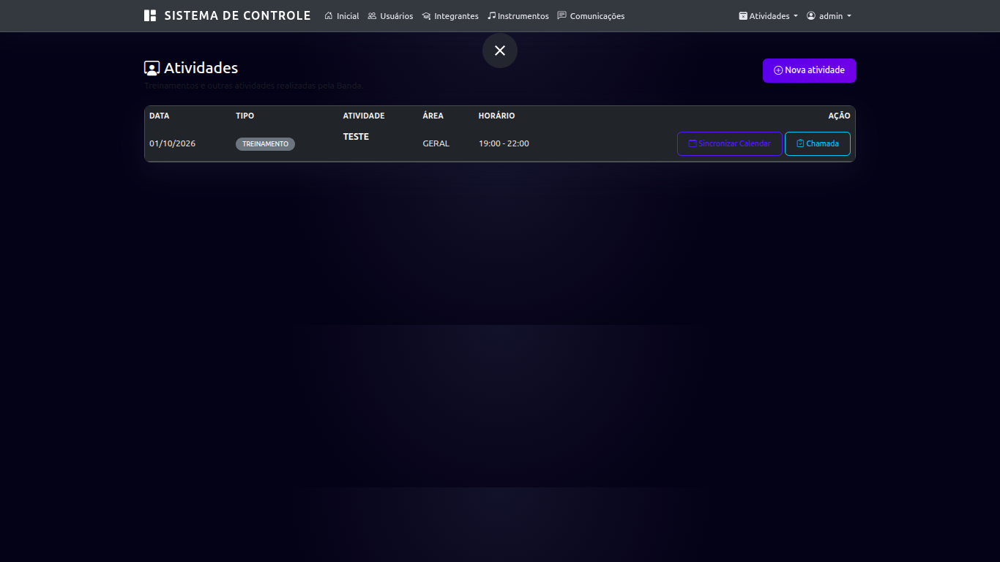

### 9.8 Consultar Histórico e Frequência

1. Abra o menu **Atividades**
2. Clique em **Relatório de presença**
3. Selecione um integrante ou mantenha **Todos os integrantes**
4. Clique em **Filtrar histórico**

O sistema exibirá as chamadas, datas, atividades, locais, integrantes e situações. Quando um integrante for selecionado, será exibido o percentual de frequência calculado com base nos registros disponíveis.

Use **Imprimir** para gerar uma cópia do histórico.

### 9.9 Consultar o resumo mensal e o relatório profissional

1. Abra o menu **Atividades** e clique em **Resumo mensal**.
2. Informe o mês de referência e clique em **Consultar**.
3. Consulte os totais de presentes, ausentes, justificados e o percentual de frequência.
4. Use **Relatório profissional** para abrir o documento formal do período, com resumo por integrante, resumo por atividade e detalhamento dos registros.

O relatório profissional é preparado para impressão e pode ser salvo como PDF pelo navegador. O relatório considera integrantes ativos e registros do mês selecionado.

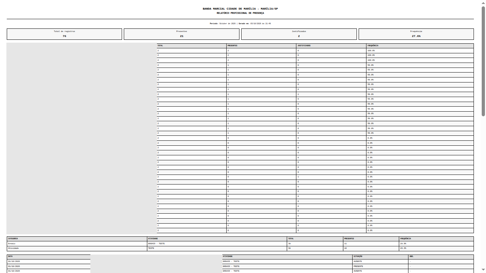

### 9.10 Administrar passes de transporte

O controle de passes está disponível para administradores em **Usuário > Passes de Transporte**.

1. Selecione o mês de referência.
2. Escolha o tipo de lançamento: **Cota mensal** ou **Avulso**.
3. Selecione um integrante com cartão ativo e informe a quantidade.
4. Para lançamento **Avulso**, informe também o motivo. O avulso pode ser lançado sem cota mensal prévia.
5. Clique em **Confirmar lançamento**.
6. Consulte **Histórico** para verificar disponibilizações, recargas, consumos, estornos e saldos.

Cada presença registrada para integrante com cartão consome 2 passes. Com saldo inferior a 2, a presença é bloqueada. Integrantes sem cartão continuam podendo registrar presença, mas não geram consumo de passes.

A quantidade avulsa deve ser maior que zero, exige motivo obrigatório e pode ser lançada uma única vez por integrante em cada mês. Integrantes sem cartão ativo não podem receber lançamentos de passes. Alterações de presença podem gerar o estorno correspondente no histórico.

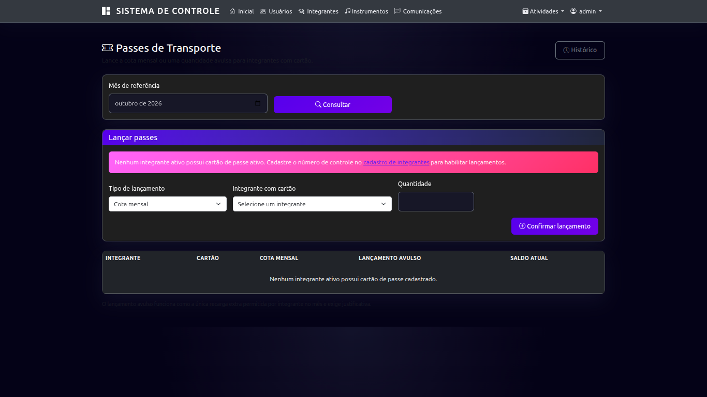

---

## 10. Relatórios

### 10.1 Relatório Geral de Alunos
Acesse para visualizar todos os alunos cadastrados com filtros por:
- Escola
- Status
- Função na banda

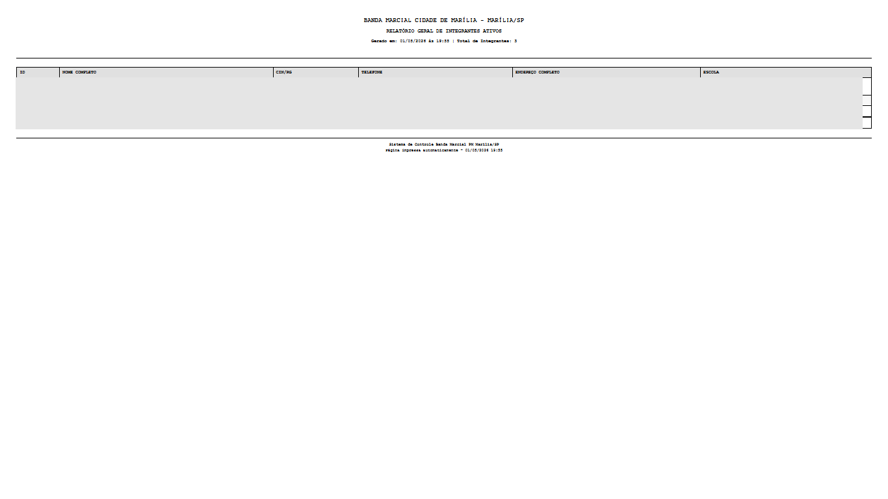

### 10.2 Relatório Individual de Aluno
Acesse através da visualização de cada aluno para obter um relatório detalhado.

### 10.3 Relatório de Escolas
Acesse para visualizar todas as escolas e seus alunos vinculados.

### 10.4 Relatório profissional de presença
O relatório profissional pode ser aberto a partir do **Resumo mensal de presenças**. Ele apresenta:

- período de referência e data de geração;
- totais de registros, presentes, justificados e frequência;
- resumo de frequência por integrante;
- resumo por ensaio, evento ou atividade;
- detalhamento de data, integrante, atividade, situação e observações.

Use a função de impressão do navegador para gerar uma versão formal em papel ou PDF.

---

## 11. Backup do Sistema

### 11.1 Criar Backup
1. No menu do usuário, no canto superior direito, selecione **Backup do Banco**.
2. Clique em **Criar Backup Agora** para gerar uma cópia local do banco.
3. Na lista de backups locais, clique em **Drive** ao lado do arquivo para enviá-lo à pasta `BMCM Backups` no Google Drive.
4. Consulte as cópias remotas na seção **Backups no Google Drive** e use **Abrir** para visualizá-las no Drive.

O envio ao Drive exige que um administrador autorize o escopo Google Drive em **Configurações**. Se o envio falhar, a cópia local continua disponível e pode ser enviada novamente. Repetir o envio de um arquivo com o mesmo nome atualiza a cópia remota.

Os novos arquivos ZIP são protegidos com AES-256. Se `BACKUP_PASSWORD` não estiver configurada, o sistema gera uma senha aleatória e a salva em `instance/.backup_password` com permissões restritas. O backup automático anterior à restauração também é criptografado.

**Aviso:** preserve `BACKUP_PASSWORD` ou `instance/.backup_password` em local seguro e separado dos ZIPs. Para restaurar em outro servidor, configure a mesma senha ou transfira o arquivo-chave por um meio seguro. Sem a chave, não será possível restaurar backups criptografados. Não troque a senha enquanto existirem backups AES-256; a interface bloqueia uma troca que os tornaria irrecuperáveis. Backups antigos sem criptografia continuam compatíveis. A restauração direta do Google Drive ainda não está disponível.

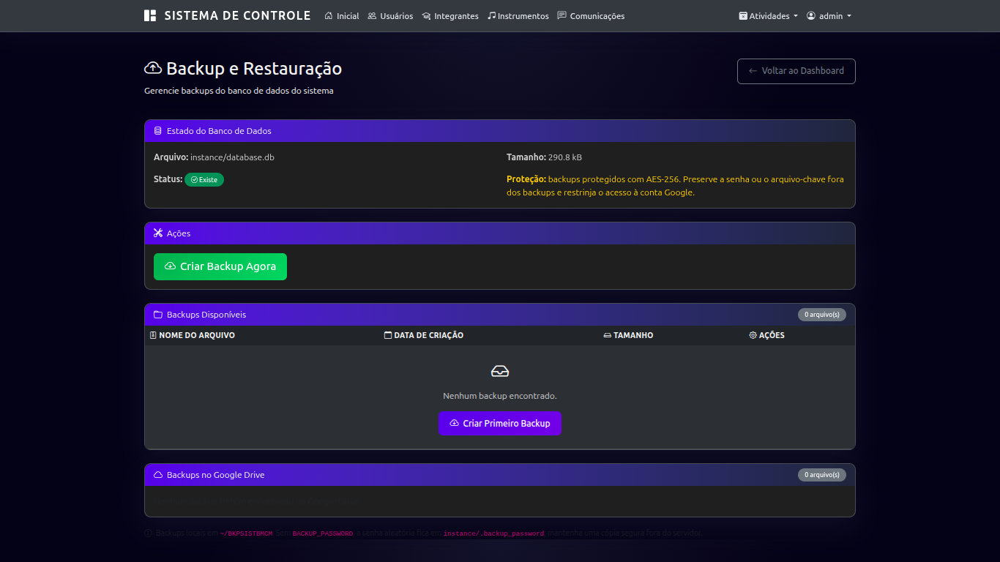

### 11.2 Restaurar Backup
1. No menu do usuário, selecione **Backup do Banco**
2. Selecione o backup desejado da lista
3. Clique em **"Restaurar"**
4. Confirme a operação

**Aviso**: A restauração substituirá todos os dados atuais. Faça um backup antes se necessário.

### 11.3 Excluir Backup
1. No menu do usuário, selecione **Backup do Banco**
2. Selecione o backup desejado
3. Clique em **"Excluir"**

---

## 12. Central de Comunicações

### 12.1 Acesso à Central
A Central de Comunicações fica disponível para usuários com permissão administrativa ou profissional. A partir dela, o administrador pode criar mensagens para públicos específicos, anexos, comunicação com contatos externos e histórico de envios.

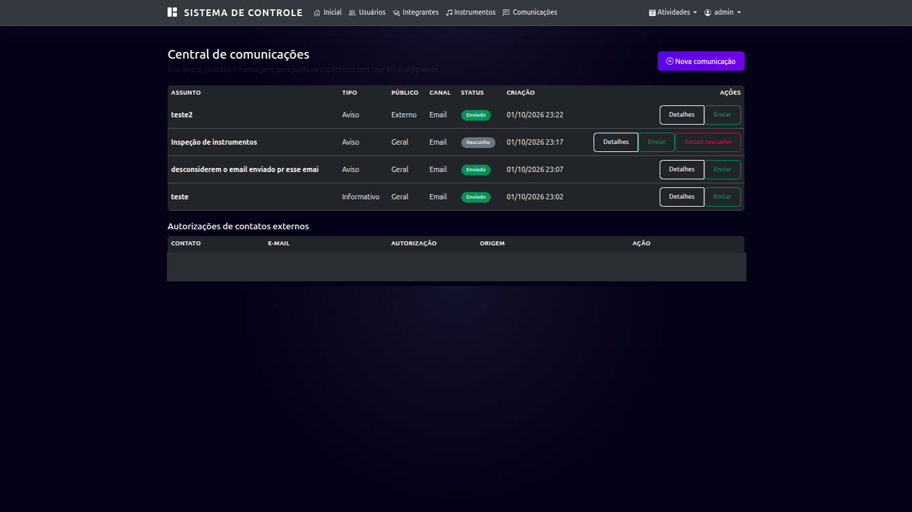

### 12.2 Criar uma comunicação
1. Acesse **Comunicações** no painel administrativo.
2. Informe assunto e mensagem.
3. Selecione o público-alvo:
   - integrante específico;
   - responsáveis;
   - alunos ativos;
   - naipe;
  - participantes ativos com autorização aprovada no evento selecionado;
   - contato externo;
   - outros públicos configurados.
4. Anexe arquivos, quando necessário.
5. Revise a mensagem e confirme o envio.

Para um contato externo novo ou sem autorização vigente, confirme a autorização de e-mail e informe sua origem. A data e a origem ficam registradas no contato. A autorização pode ser revogada na lista da Central; após a revogação, novos envios são bloqueados. A autorização de e-mail não habilita WhatsApp.

### 12.3 Status do envio
A comunicação pode aparecer com os seguintes status:
- **Rascunho**
- **Enviado**
- **Parcial**
- **Falhou**

O sistema registra o resultado por destinatário e mantém o histórico do envio para auditoria.

### 12.4 Uso do Gmail na comunicação
Quando a conexão com o Google estiver autorizada, a comunicação pode ser enviada por Gmail, respeitando o remetente configurado no sistema e os escopos do OAuth. O canal é controlado e não substitui automaticamente outras formas de envio autorizadas.

---

## 13. Alteração de Senha

### 12.1 Alterar Própria Senha
1. Clique no seu nome de usuário no menu superior
2. Selecione **"Alterar Senha"**
3. Preencha:

- Senha atual
- Nova senha
- Confirme a nova senha
1. Clique em **"Salvar"**

---

## 14. Logout

### 14.1 Sair do Sistema
1. Clique no seu nome de usuário no menu superior
2. Selecione **"Sair"**

---

## 15. Perfis de Usuário

### 15.1 Administrador
Acesso completo a todas as funcionalidades:
- Gestão de usuários
- Gestão de alunos
- Gestão de escolas
- Gestão de instrumentos
- Relatórios
- Backup
- Configurações do sistema
- Autorização do Google Workspace
- Central de Comunicações

### 15.2 Profissional
Acesso às funcionalidades de gestão:
- Gestão de alunos
- Gestão de escolas
- Gestão de instrumentos
- Relatórios
- Central de Comunicações

### 15.3 Usuário Comum
Acesso básico:
- Visualização de dados
- Relatórios

---

## 16. Dicas de Segurança

1. **Senhas**: Use senhas fortes com no mínimo 6 caracteres
2. **Logout**: Sempre saia do sistema após o uso
3. **Compartilhamento**: Não compartilhe suas credenciais
4. **Bloqueio**: O sistema bloqueia o usuário após 3 tentativas de login incorretas por 12 horas
### 16.1 Boas Práticas de Segurança

- Utilize senhas com:
  - mínimo de 8 caracteres
  - letras maiúsculas e minúsculas
  - números e símbolos

- Não compartilhe suas credenciais

- Evite acessar o sistema em redes públicas

- Sempre realize logout após o uso

- Altere sua senha periodicamente

- Mantenha o arquivo `.env` protegido e fora do GitHub

- Não exponha tokens de OAuth, senhas ou chaves em arquivos do projeto
---

## 17. Solução de Problemas

### 17.1 Esqueci minha senha
Entre em contato com o administrador do sistema para resetar sua senha.

### 17.2 Usuário bloqueado
O sistema bloqueia automaticamente após 3 tentativas incorretas. Aguarde 12 horas ou entre em contato com o administrador.

### 17.3 Não consigo acessar uma funcionalidade
Verifique se seu perfil de usuário tem permissão para acessar aquela funcionalidade. Entre em contato com o administrador se necessário.

### 17.4 Dados não aparecem
Verifique se você tem permissão de acesso. Alguns dados podem estar filtrados por perfil.

### 17.5 Google OAuth não funciona
Verifique se o arquivo `.env` está corretamente preenchido, se as variáveis do Google estão corretas e se a URI de retorno coincide com a configuração registrada no Google Cloud.

---
## 18. Problemas Comuns e Soluções

### ❌ Não consigo salvar o aluno
- Verifique campos obrigatórios
- Confirme autorização de menor (se aplicável)

---

### ❌ CEP não preenche automaticamente
- Verifique conexão com internet
- Preencha manualmente os dados

---

### ❌ Usuário bloqueado
- O sistema bloqueia após 3 tentativas
- Aguarde 12 horas ou solicite desbloqueio

---

### ❌ Dados não aparecem
- Verifique filtros ativos
- Confirme permissões do usuário

---

### ❌ Não consigo excluir escola
- Pode haver alunos vinculados
- Remova vínculos antes de excluir

---

## 19. Contato e Suporte

Para dúvidas ou problemas técnicos, entre em contato com o administrador do sistema.

### 19.1 Identificação da versão

A versão atual da aplicação é exibida na tela de login, na área de créditos e nas configurações administrativas.

O formato possui três partes, como em `1.4.5`:

- primeira parte: versão principal;
- segunda parte: atualização ou etapa funcional;
- terceira parte: contagem incremental de alterações. Ao passar de `99`, o segundo componente é incrementado; se ele também passar de `99`, o primeiro componente é incrementado.

Essa identificação é mantida pela equipe responsável pelo desenvolvimento. O usuário não deve alterar a versão pelas configurações do sistema.

---

**Versão do Manual**: 1.3
**Sistema**: Sistema BMCM - Banda Marcial Municipal de Marília
**Data de Criação**: 2026

---
