# Sistema de Gestao de Integrantes da Banda Marcial Municipal de Marilia - SP

<div align="center">


[](https://www.python.org/)
[](https://flask.palletsprojects.com/)
[](https://getbootstrap.com/)
[](LICENSE)

</div>

## Sumario

- [Sistema de Gestao de Integrantes da Banda Marcial Municipal de Marilia - SP](#sistema-de-gestao-de-integrantes-da-banda-marcial-municipal-de-marilia---sp)
  - [Sumario](#sumario)
  - [Nome do Projeto](#nome-do-projeto)
  - [Contexto e Justificativa](#contexto-e-justificativa)
  - [Objetivos](#objetivos)
    - [Objetivo Geral](#objetivo-geral)
    - [Objetivos Especificos](#objetivos-especificos)
  - [Escopo Funcional](#escopo-funcional)
  - [Tecnologias Utilizadas](#tecnologias-utilizadas)
  - [Arquitetura e Estrutura do Projeto](#arquitetura-e-estrutura-do-projeto)
  - [Modelo de Dados](#modelo-de-dados)
  - [Regras de Negocio Relevantes](#regras-de-negocio-relevantes)
  - [Instalacao e Configuracao](#instalacao-e-configuracao)
    - [Pre-requisitos](#pre-requisitos)
    - [Passos](#passos)
    - [Variáveis de ambiente (opcionais)](#variáveis-de-ambiente-opcionais)
  - [Execucao do Sistema](#execucao-do-sistema)
    - [Credencial inicial](#credencial-inicial)
  - [Manual do Usuário](#manual-do-usuário)
  - [Testes Automatizados](#testes-automatizados)
  - [Seguranca e Boas Praticas](#seguranca-e-boas-praticas)
  - [Evidencias de Interface](#evidencias-de-interface)
  - [Integrantes](#integrantes)
  - [Facilitadora UNIVESP](#facilitadora-univesp)
  - [Licenca](#licenca)
  - [Bibliografia](#bibliografia)
    - [Documentos institucionais UNIVESP](#documentos-institucionais-univesp)
    - [Metodologia e desenvolvimento de software](#metodologia-e-desenvolvimento-de-software)
    - [Desenvolvimento Flask e Bootstrap](#desenvolvimento-flask-e-bootstrap)

## Nome do Projeto

Sistema web para apoio a gestao administrativa da Banda Marcial Municipal de Marilia - SP, desenvolvido no contexto do Projeto Integrado I (UNIVESP).

## Contexto e Justificativa

A gestao manual de integrantes, instrumentos, escolas e relatorios gera retrabalho, inconsistencias cadastrais e baixa rastreabilidade historica.

O projeto foi concebido para:
- centralizar os dados em um unico sistema;
- reduzir erros de cadastro por meio de validacoes;
- apoiar decisoes administrativas com relatorios;
- manter historico institucional por inativacao (em vez de exclusao imediata).

## Objetivos

### Objetivo Geral

Desenvolver uma aplicacao web para cadastro, consulta, atualizacao e acompanhamento de integrantes da banda marcial, com foco em organizacao administrativa e continuidade historica dos dados.

### Objetivos Especificos

- Implementar autenticacao e controle de acesso por perfil.
- Estruturar banco de dados relacional para entidades da banda.
- Disponibilizar CRUD para usuarios, integrantes, escolas e instrumentos.
- Implementar relatorios operacionais para apoio de gestao.
- Padronizar dados sensiveis (ex.: telefone, e-mail e documento).
- Incluir validacoes para consentimento de imagem de menores (LGPD).

## Escopo Funcional

Funcionalidades implementadas no estado atual do projeto:

- **Autenticacao e contas**
  - Login com bloqueio apos tentativas invalidas.
  - Troca obrigatoria de senha no primeiro acesso do admin padrao.
  - Gestao de usuarios (criar, editar, ativar/inativar, reset de senha).

- **Gestao de integrantes**
  - Cadastro, edicao, inativacao e listagem com filtros.
  - Dados pessoais, contato, endereco, responsaveis e vinculacao escolar.
  - Upload de foto de integrante.
  - Mascara de documento (CIN/RG e CPF) no formulario.

- **Gestao de escolas**
  - Cadastro, edicao, exclusao e relatorio por escola.

- **Gestao de instrumentos**
  - Cadastro, edicao, ativacao/inativacao e exclusao.
  - Campos de estado, patrimonio, marca, modelo e observacoes.

- **Relatorios**
  - Relatorio geral de integrantes.
  - Relatorio individual de integrante.
  - Relatorio de integrantes por escola.

- **Endereco por CEP**
  - Busca local em base de logradouros.
  - Fallback para ViaCEP quando nao encontrado localmente.

## Tecnologias Utilizadas

[](https://www.python.org/)
[](https://flask.palletsprojects.com/)


[](https://getbootstrap.com/)


Principais bibliotecas (conforme `requirements.txt`):
- Flask, Flask-Login, Flask-SQLAlchemy
- SQLAlchemy
- Requests (integracao CEP)
- Gunicorn (deploy) → **Waitress** (servidor WSGI utilizado)
- BeautifulSoup4 (dependencia presente no projeto)

## Arquitetura e Estrutura do Projeto

O projeto segue arquitetura em camadas leves com Flask:

- `app/__init__.py`: factory da aplicacao, inicializacao do banco, login manager e seed inicial.
- `app/auth.py`: rotas de autenticacao.
- `app/routes.py`: rotas de dominio (usuarios, alunos, escolas, instrumentos, relatorios).
- `app/models.py`: modelos SQLAlchemy.
- `app/utils.py`: regras auxiliares, normalizacao, seed e funcoes de consentimento.
- `templates/`: telas HTML (Bootstrap + Jinja2).
- `static/`: arquivos estaticos (CSS, imagens e uploads).
- `tests/`: testes automatizados com pytest.
- `run.py`: ponto de entrada para execucao local.
- `config.py`: configuracoes da aplicacao.

Estrutura resumida:

```text
.
├── app/
│   ├── __init__.py
│   ├── auth.py
│   ├── models.py
│   ├── routes.py
│   └── utils.py
├── templates/
├── static/
├── tests/
│   └── test_aluno_fluxo.py
├── config.py
├── run.py
└── requirements.txt
```

## Modelo de Dados

Banco principal: SQLite (`instance/database.db` por padrão, conforme `config.py`).

Entidades mapeadas:

- `User`
- `Aluno`
- `Responsavel`
- `Escola`
- `AlunoEscola`
- `Instrumento`
- `AlunoInstrumento`
- `Uniforme`
- `Presenca`
- `Cidade`
- `Logradouro`
- `AutorizacaoFotoMenor`
- `AutorizacaoViagem`
- `Evento`
- tabelas de referencia: `Naipe`, `TipoInstrumento`, `FuncaoBanda`

Observacoes:
- `Aluno.cin_rg` e unico.
- O sistema cria automaticamente dados iniciais de tipos/naipes/funcoes.
- Ha importacao automatica de municipios/logradouros quando o arquivo `municipios.sql` esta presente.

## Regras de Negocio Relevantes

- **Acesso**
  - Rotas administrativas exigem usuario autenticado e, quando aplicavel, perfil admin.

- **Bloqueio de login**
  - Apos 3 tentativas invalidas, o usuario e bloqueado por 12 horas.

- **Dados de integrantes**
  - Integrantes podem ser inativados para preservar historico.
  - Campos textuais sao normalizados em caixa alta em pontos especificos.
  - Telefone e normalizado para padrao nacional.

- **Documento no cadastro**
  - Campo `cin_rg` aceita formato de CIN/RG e CPF no frontend, com mascara dinamica.
  - O backend persiste o valor informado no campo `cin_rg`.

- **Consentimento de imagem de menor (LGPD)**
  - Para menor de 18 anos (ou data ausente, conforme regra adotada), ha exigencia de autorizacao quando houver foto.
  - O consentimento inclui aceite e assinatura digital desenhada no navegador.

## Instalacao e Configuracao

### Pre-requisitos

- Python 3.12+
- `venv` habilitado no sistema

### Passos

```bash
# Acessar o diretório do projeto
cd sistemaBMCM

# Criar ambiente virtual
python -m venv venv

# Ativar ambiente virtual
# Linux/Mac:
# Linux/Mac:
source venv/bin/activate
# Windows (PowerShell):
.\venv\Scripts\Activate
# Windows (CMD):
venv\Scripts\activate.bat

# Atualizar pip e instalar dependências
pip install --upgrade pip
pip install -r requirements.txt
```

> **Nota**: O projeto utiliza **Waitress** como servidor WSGI (definido em `requirements.txt`), não Gunicorn.

### Variáveis de ambiente (opcionais)

- `SECRET_KEY`: chave de sessão Flask.
- `DATABASE_URL`: URL do banco; se ausente, usa SQLite local em `instance\database.db`.

Exemplo:

```bash
# Windows (PowerShell)
$env:SECRET_KEY="sua_chave_forte"
$env:DATABASE_URL="sqlite:///instance/database.db"

# Windows (CMD)
set SECRET_KEY=sua_chave_forte
set DATABASE_URL=sqlite:///instance/database.db

# Linux/Mac
export SECRET_KEY="sua_chave_forte"
export DATABASE_URL="sqlite:///instance/database.db"
```

## Execucao do Sistema

Com ambiente virtual ativo:

```bash
python run.py
```

Por padrao, o sistema cria tabelas e dados iniciais automaticamente no startup.

### Credencial inicial

Quando nao existe usuario administrador no banco, o sistema cria:
- usuario: `admin`
- senha inicial: `123456`

No primeiro login, a troca de senha e obrigatoria.

## Manual do Usuário

Para instruções detalhadas de utilização do sistema, consulte o manual completo:

📄 [Manual do Usuário](./MANUAL_USUARIO.md)

## Testes Automatizados

Suite atual implementada:

- `tests/test_aluno_fluxo.py`
  - criacao de integrante;
  - edicao de integrante;
  - persistencia de documento no `cin_rg` com valor em formato de CPF.

Execucao:

```bash
# Windows
python -m pytest -q tests/test_aluno_fluxo.py

# Todos os testes
python -m pytest -q

# Linux/Mac
./venv/bin/python -m pytest -q tests/test_aluno_fluxo.py
./venv/bin/python -m pytest -q
```

## Seguranca e Boas Praticas

- Senhas armazenadas com hash (Werkzeug).
- Controle de sessao com Flask-Login.
- Bloqueio temporario por tentativas invalidas de login.
- Consentimento explicito para uso de imagem de menor.
- Recomendado para producao:
  - definir `SECRET_KEY` forte via ambiente;
  - rodar atrás de servidor WSGI (ex.: **Waitress**) e proxy reverso;
  - ativar HTTPS.

## Evidencias de Interface

Imagens presentes no repositório:

| Tela | Arquivo | Descrição |
|------|---------|-----------|
| Login | `assets/imgs/Login.png` | Página de autenticação do sistema |
| Bloqueio | `assets/imgs/bloq.png` | Tela de bloqueio após tentativas inválidas |
| Dashboard | `assets/imgs/Dash.png` | Painel principal com estatísticas |


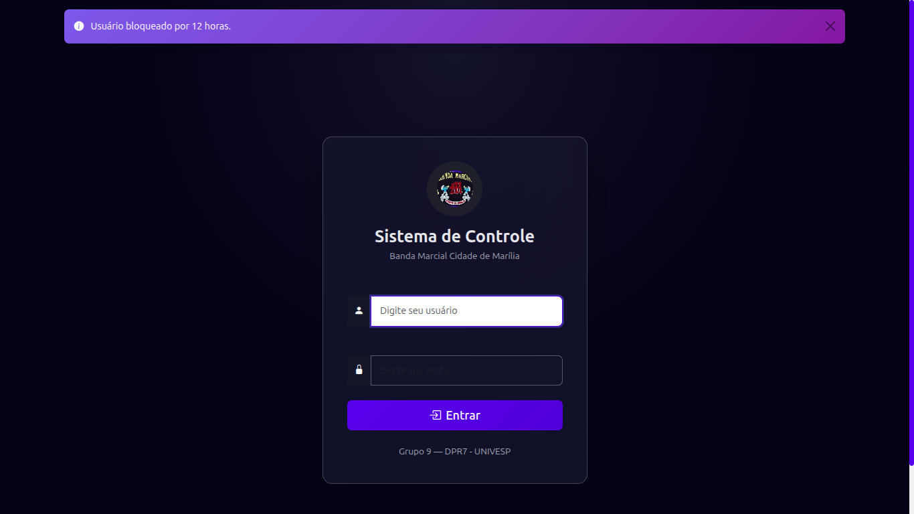


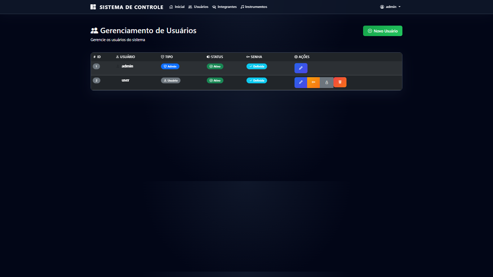
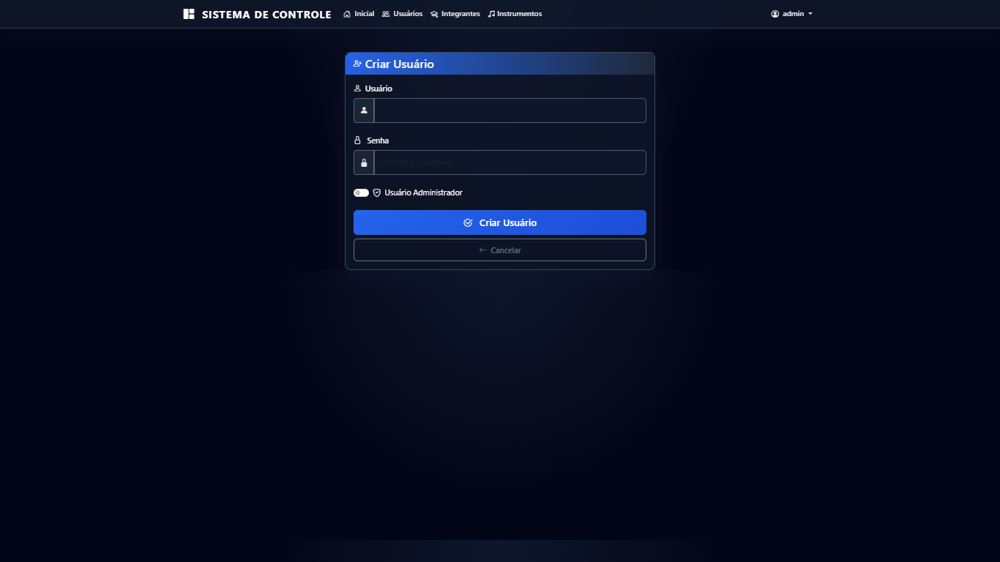
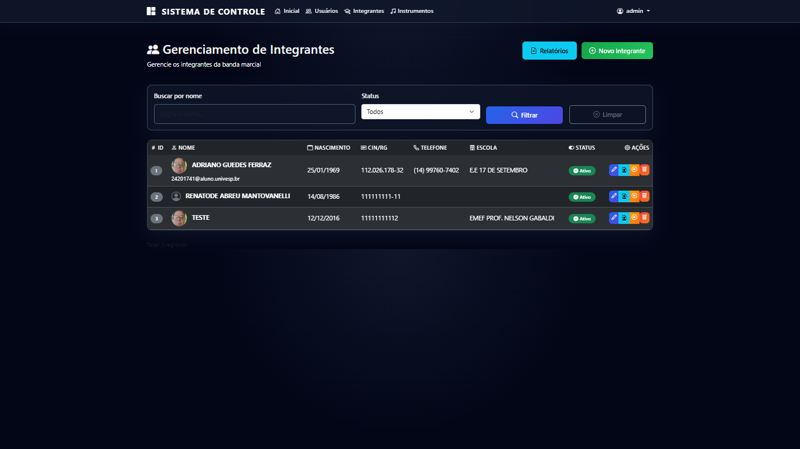
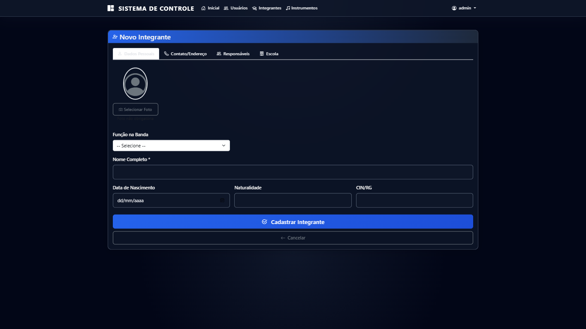
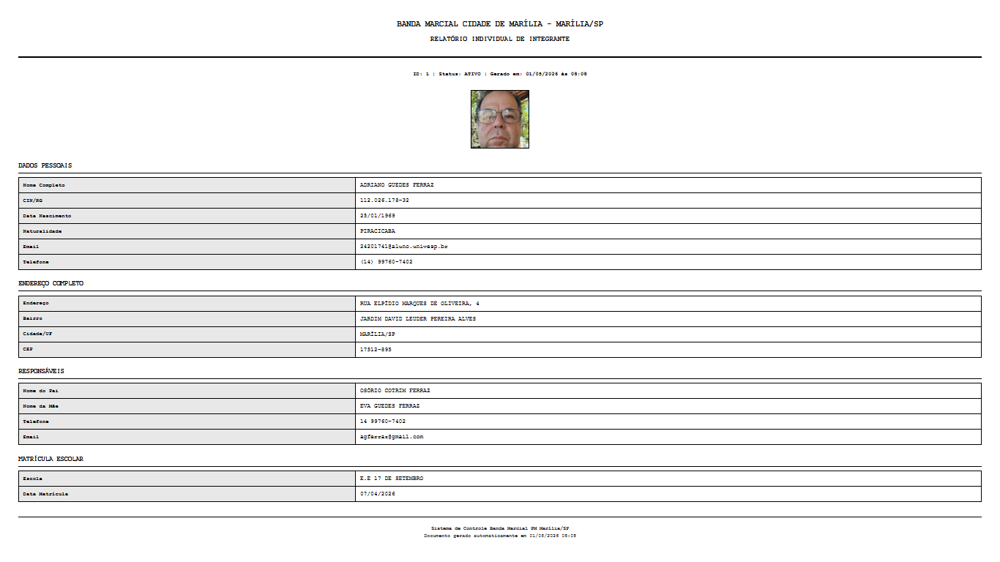
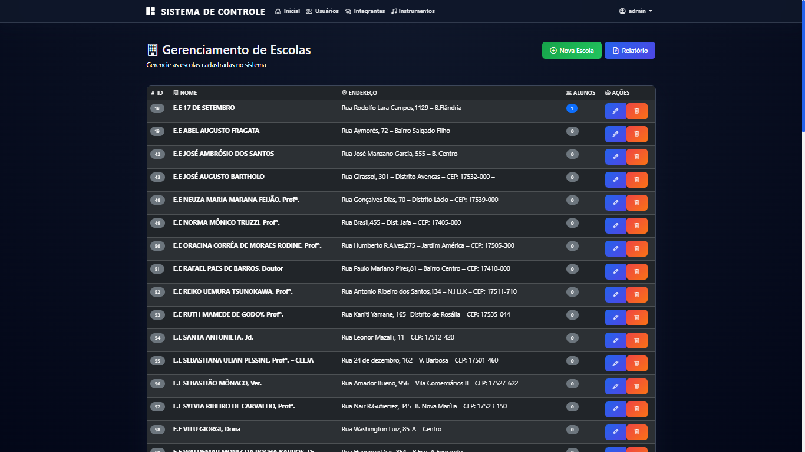
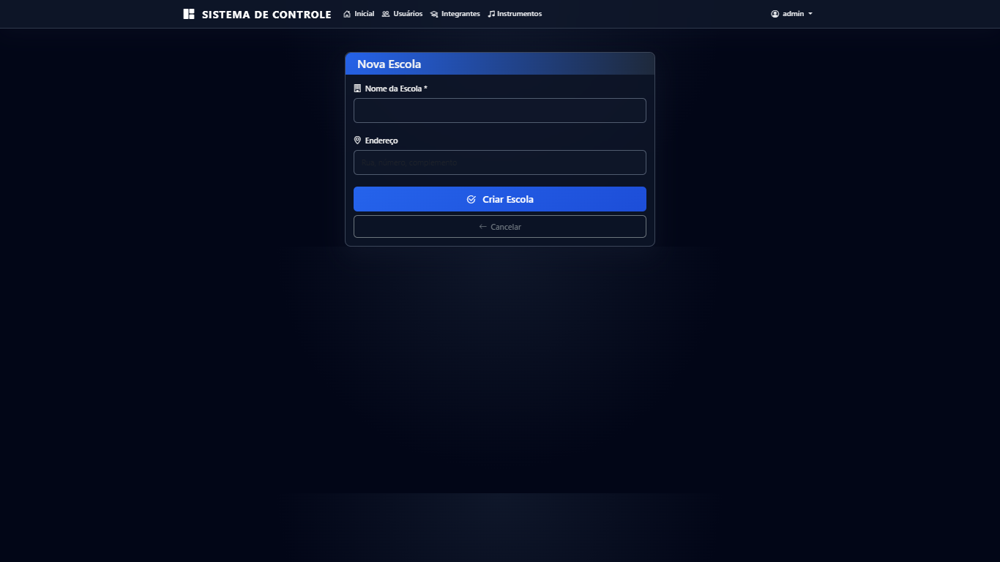
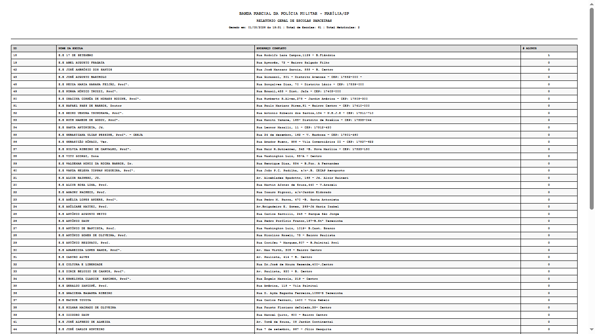
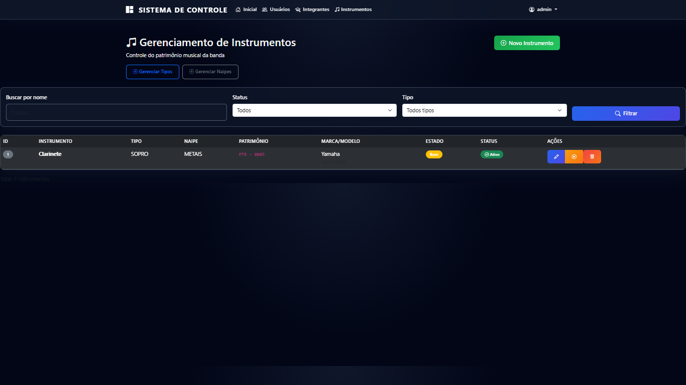
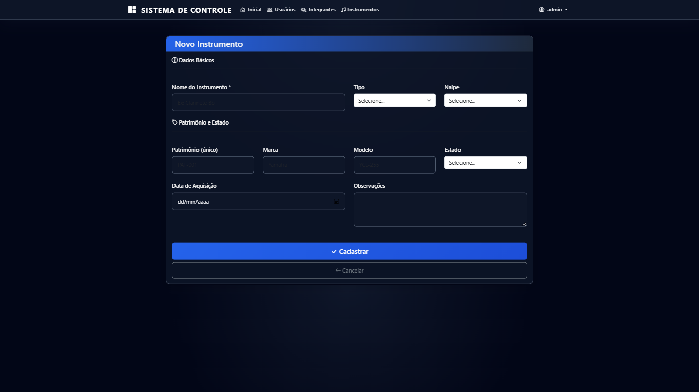
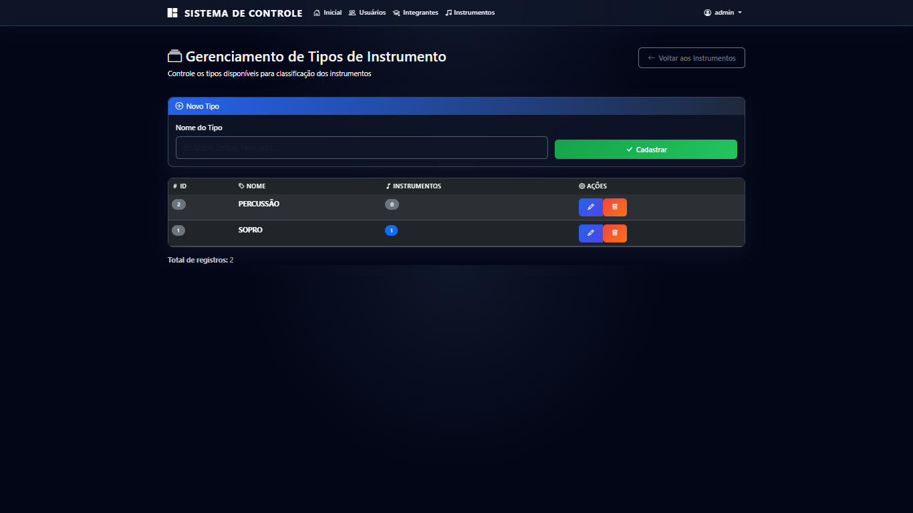
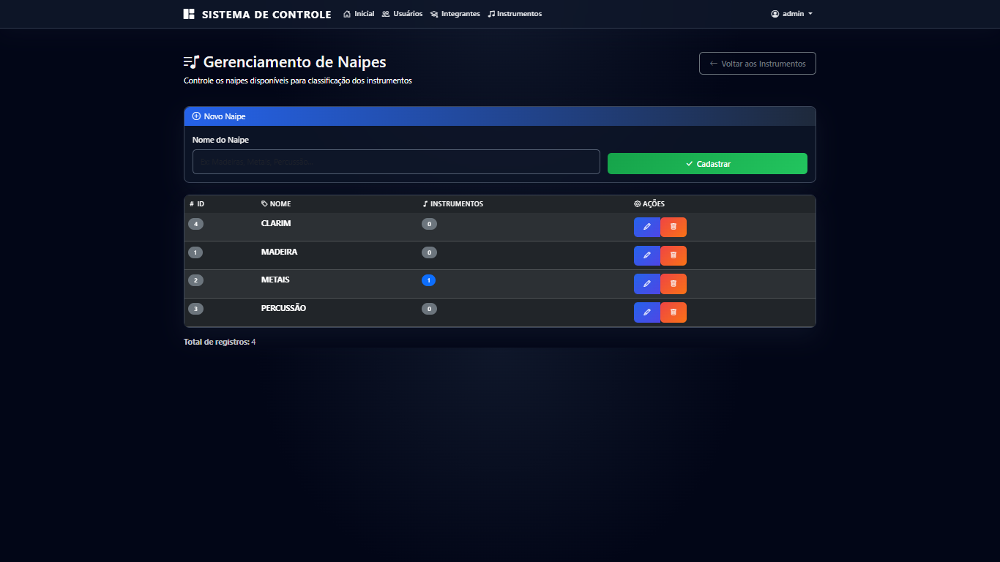
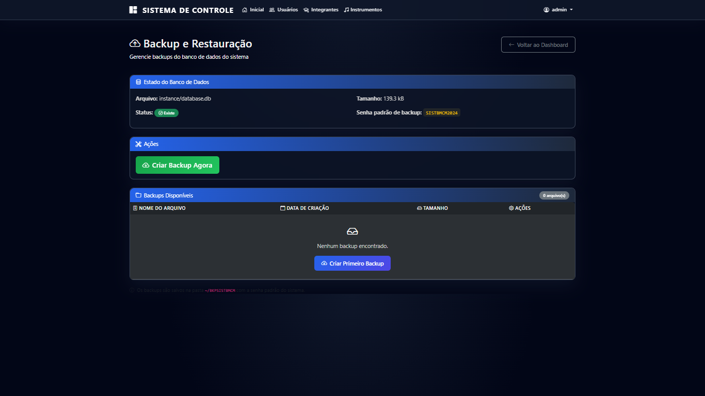
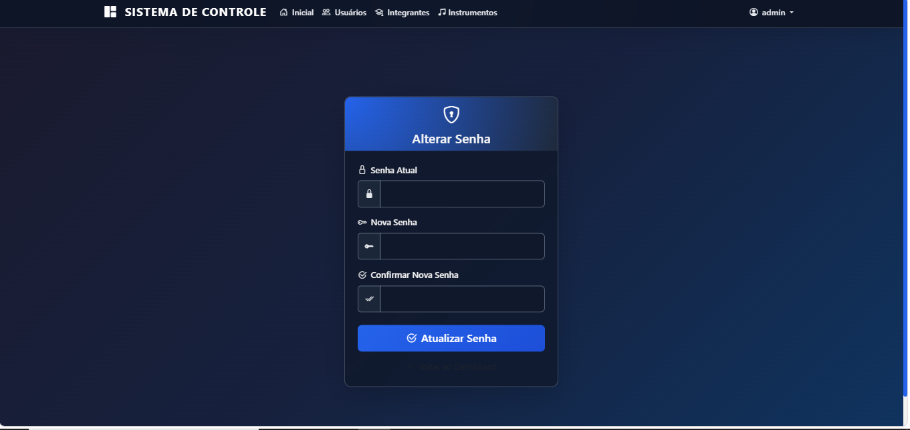

## Integrantes

1. Adriano Guedes Ferraz
2. Alessandra da Silva Zanirato Garcia
3. Aparecido Fernandes de Souza
4. David Miguel Soares Junior
5. Fabiane Fernanda de Barros Ranke
6. Felipe Oldani dos Santos
7. Kelly Cristina Ferreira da Costa
8. Rafael Veranelli Scalzo Moraes
9. Renato de Abreu Mantovanelli

## Facilitadora UNIVESP

- David Miguel Soares Junior

## Licenca

[](LICENSE)

## Bibliografia

### Documentos institucionais UNIVESP

- UNIVESP. Orientacoes para alunos de Projeto Integrador. Sao Paulo: UNIVESP, 2023.
- UNIVESP. Orientacoes para avaliacao do Projeto Integrador. Sao Paulo: UNIVESP, 2021.

### Metodologia e desenvolvimento de software

- SOMMERVILLE, I. Engenharia de software. 10. ed.
- PRESSMAN, R. S. Engenharia de software: uma abordagem profissional. 9. ed.
- LAUDON, K. C.; LAUDON, J. P. Sistemas de informacao gerenciais.

### Desenvolvimento Flask e Bootstrap

- Flask Documentation. Disponivel em: https://flask.palletsprojects.com/
- SQLAlchemy Documentation. Disponivel em: https://docs.sqlalchemy.org/
- Bootstrap Documentation. Disponivel em: https://getbootstrap.com/docs/5.3/

