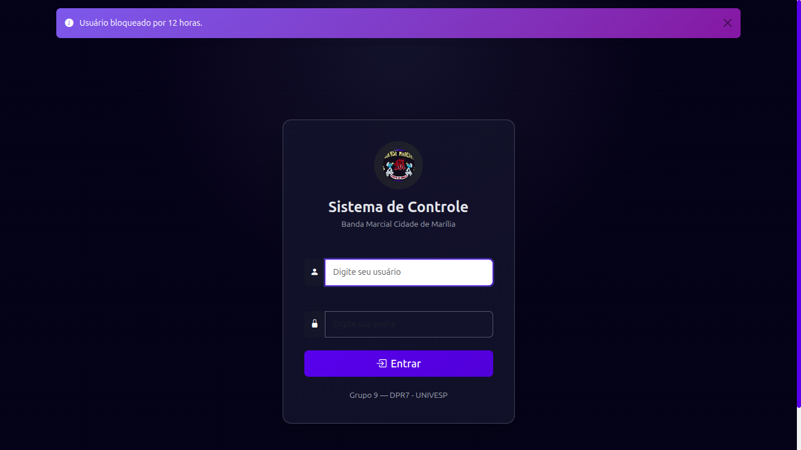
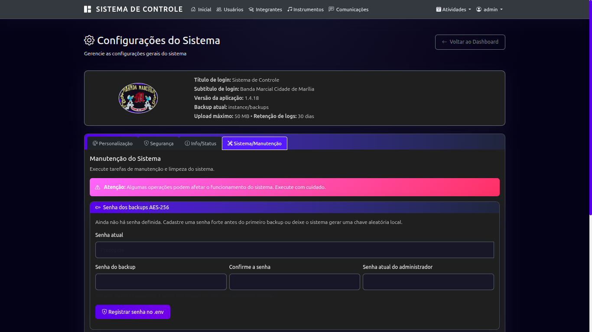
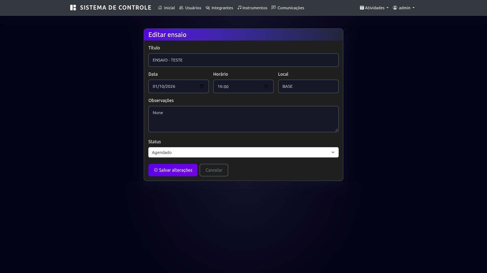
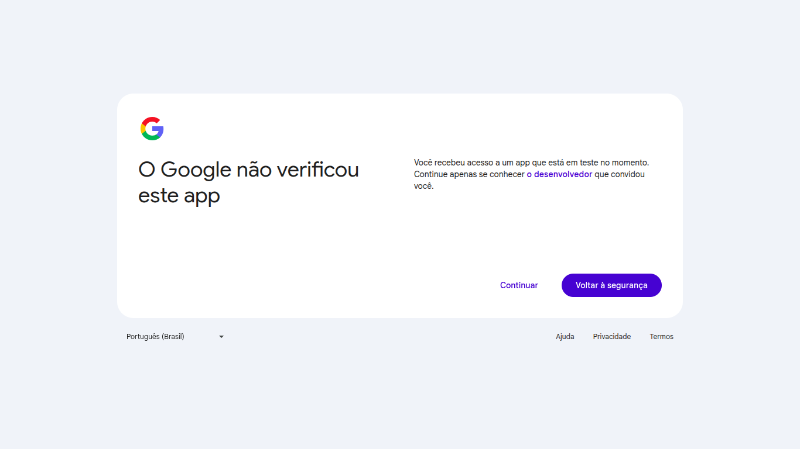
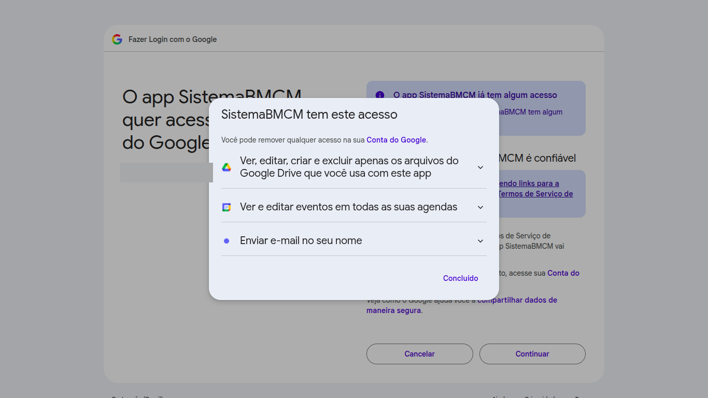

# Sistema de Gestão de Integrantes da Banda Marcial Municipal de Marília - SP

<div align="center">


[](https://www.python.org/)
[](https://flask.palletsprojects.com/)
[](https://getbootstrap.com/)
[](LICENSE)

</div>

---

## Sumário

- [Sistema de Gestão de Integrantes da Banda Marcial Municipal de Marília - SP](#sistema-de-gestão-de-integrantes-da-banda-marcial-municipal-de-marília---sp)
  - [Sumário](#sumário)
- [Nome do Projeto](#nome-do-projeto)
- [Contexto e Justificativa](#contexto-e-justificativa)
- [Evolução do Projeto - PI I e PI II](#evolução-do-projeto---pi-i-e-pi-ii)
  - [Atualizações realizadas no PI II](#atualizações-realizadas-no-pi-ii)
  - [Controle de versão da aplicação](#controle-de-versão-da-aplicação)
- [Objetivos](#objetivos)
  - [Objetivo Geral](#objetivo-geral)
  - [Objetivos Específicos](#objetivos-específicos)
- [Escopo Funcional](#escopo-funcional)
  - [Funcionalidades Implementadas](#funcionalidades-implementadas)
    - [Autenticação e contas](#autenticação-e-contas)
    - [Gestão de integrantes](#gestão-de-integrantes)
    - [Gestão de escolas](#gestão-de-escolas)
    - [Gestão de instrumentos](#gestão-de-instrumentos)
    - [Relatórios](#relatórios)
    - [Endereço por CEP](#endereço-por-cep)
- [Funcionalidades em Evolução](#funcionalidades-em-evolução)
  - [Controle de presença](#controle-de-presença)
    - [Controle de passes](#controle-de-passes)
  - [Ensaios](#ensaios)
  - [Eventos e apresentações](#eventos-e-apresentações)
- [Integrações Google: Situação e Próximas Etapas](#integrações-google-situação-e-próximas-etapas)
  - [Google Drive](#google-drive)
  - [Google Calendar](#google-calendar)
  - [Gmail](#gmail)
- [Tecnologias Utilizadas](#tecnologias-utilizadas)
- [Arquitetura e Estrutura do Projeto](#arquitetura-e-estrutura-do-projeto)
- [Uso de JavaScript no sistema](#uso-de-javascript-no-sistema)
- [Modelo de Dados](#modelo-de-dados)
- [Regras de Negócio Relevantes](#regras-de-negócio-relevantes)
  - [Acesso](#acesso)
  - [Bloqueio de login](#bloqueio-de-login)
  - [Dados de integrantes](#dados-de-integrantes)
  - [Documento](#documento)
  - [Consentimento de imagem de menor](#consentimento-de-imagem-de-menor)
- [Acessibilidade e Experiência do Usuário](#acessibilidade-e-experiência-do-usuário)
  - [Análise opcional de presença e indicadores de dados](#análise-opcional-de-presença-e-indicadores-de-dados)
- [Segurança e Privacidade](#segurança-e-privacidade)
- [APIs e Serviços Externos](#apis-e-serviços-externos)
- [Computação em Nuvem](#computação-em-nuvem)
- [Instalação e Configuração](#instalação-e-configuração)
  - [Pré-requisitos](#pré-requisitos)
  - [Passos](#passos)
    - [Windows - PowerShell](#windows---powershell)
    - [Windows - CMD](#windows---cmd)
    - [Linux/Mac](#linuxmac)
- [Variáveis de Ambiente](#variáveis-de-ambiente)
- [Execução do Sistema](#execução-do-sistema)
- [Credencial Inicial](#credencial-inicial)
- [Manual do Usuário](#manual-do-usuário)
- [Testes Automatizados](#testes-automatizados)
    - [Windows](#windows)
    - [Linux/Mac](#linuxmac-1)
- [Controle de Versão](#controle-de-versão)
- [Evidências de Interface](#evidências-de-interface)
- [Integrantes](#integrantes)
- [Facilitadora UNIVESP](#facilitadora-univesp)
- [Licença](#licença)
- [Bibliografia](#bibliografia)
  - [Documentos institucionais UNIVESP](#documentos-institucionais-univesp)
  - [Metodologia e desenvolvimento de software](#metodologia-e-desenvolvimento-de-software)
  - [Desenvolvimento Web](#desenvolvimento-web)
  - [APIs e serviços externos](#apis-e-serviços-externos-1)
- [Status do Projeto](#status-do-projeto)
    - [Principais objetivos da evolução](#principais-objetivos-da-evolução)
  - [Princípio de evolução](#princípio-de-evolução)

---

# Nome do Projeto

**Sistema de Gestão de Integrantes da Banda Marcial Municipal de Marília - SP**

Sistema web desenvolvido para apoiar a gestão administrativa e operacional da Banda Marcial Municipal de Marília - SP.

O projeto foi desenvolvido inicialmente no contexto do **Projeto Integrador I (PI I) da UNIVESP** e encontra-se em processo de evolução no **Projeto Integrador II (PI II)**.

A proposta do PI II é dar continuidade ao sistema existente, preservando suas funcionalidades e arquitetura sempre que tecnicamente adequado, incorporando novos recursos relacionados à gestão de integrantes, presença, ensaios, eventos, comunicação, acessibilidade, integração por APIs e utilização de serviços em nuvem.

---

# Contexto e Justificativa

A gestão de integrantes de uma banda marcial envolve informações cadastrais, escolares, familiares, instrumentos, uniformes, ensaios, apresentações, eventos e registros históricos.

Quando essas informações são mantidas de forma manual ou distribuídas em diferentes arquivos e sistemas, podem ocorrer:

* retrabalho administrativo;
* inconsistências cadastrais;
* dificuldade de atualização das informações;
* perda de histórico;
* dificuldade na elaboração de relatórios;
* dificuldade de acompanhamento da frequência;
* problemas de comunicação entre administração e integrantes.

O sistema BMCM foi concebido para centralizar essas informações em uma aplicação web, proporcionando maior organização, padronização e rastreabilidade.

A evolução do projeto no PI II busca ampliar essa proposta, transformando o sistema em uma ferramenta de apoio mais abrangente à gestão cotidiana da banda.

---

# Evolução do Projeto - PI I e PI II

O desenvolvimento do BMCM é tratado como um processo contínuo.

O **PI I** concentrou-se principalmente na construção da estrutura inicial da aplicação, incluindo:

* autenticação;
* gerenciamento de usuários;
* cadastro de integrantes;
* cadastro de escolas;
* cadastro de instrumentos;
* banco de dados relacional;
* relatórios;
* regras de negócio;
* segurança básica;
* validações;
* interface web responsiva.

O **PI II** não tem como objetivo reconstruir o sistema.

A proposta é **evoluir a aplicação existente**, acrescentando funcionalidades que atendam às necessidades atuais da banda e aos requisitos acadêmicos do novo projeto.

Entre os principais eixos da evolução estão:

* validação com conta Google real da publicação de atividades avulsas no Calendar;
* implementação e validação real da restauração de backups do Google Drive;
* testes automatizados e validação prática dos recursos de acessibilidade;
* utilização de APIs externas;
* aplicação prática do conceito de computação em nuvem;
* manutenção da segurança e da privacidade dos dados.

A evolução será realizada de forma incremental, preservando funcionalidades existentes sempre que possível.

## Atualizações realizadas no PI II

As seguintes melhorias já foram incorporadas ao sistema existente:

* criação de ambiente virtual em `venv/` e organização das dependências;
* inclusão do `pytest` na lista de dependências de desenvolvimento;
* preferências individuais de tema e tamanho do texto para acessibilidade;
* proteção CSRF para requisições `POST` e formulários;
* correção de compatibilidade com SQLAlchemy 2 nas rotinas de manutenção;
* proteção dos caminhos de restauração e exclusão de backups;
* uso de chave secreta configurável por variável de ambiente;
* associação de instrumentos aos integrantes, com histórico de empréstimo e devolução;
* exibição do instrumento associado nas listagens e relatórios;
* criação de ensaios com data, horário, local, observações e status;
* criação e gerenciamento de eventos e apresentações;
* folha de chamada agrupada pelo instrumento do integrante;
* marcação de presença, ausência e justificativa;
* histórico de presença e cálculo de frequência;
* impressão da folha de chamada e do histórico;
* preservação do histórico ao editar ou cancelar ensaios e eventos;
* migrações incrementais para adequar bancos existentes às novas tabelas e colunas;
* correção dos relacionamentos duplicados entre eventos e autorizações de viagem;
* central de comunicações com públicos específicos, anexos, histórico e status por destinatário;
* envio para participantes ativos com autorização aprovada no evento;
* registro da data e origem do consentimento de e-mail de contatos externos, com bloqueio após revogação;
* calendário interno mensal reunindo ensaios, eventos e atividades, com acesso às chamadas e relatórios por data;
* calendário administrativo com filtros por tipo, status e texto, visão mensal e visão Agenda;
* indicadores de registros, chamadas pendentes, chamadas realizadas e presenças no período;
* resumo mensal de presença e relatório profissional por integrante, atividade e registro detalhado;
* controle de cartões, cotas mensais, recargas, consumos, estornos e histórico auditável de passes;
* fluxo OAuth 2.0 do Google e envio de mensagens pelo Gmail;
* configuração do OAuth por variáveis de ambiente e arquivo local `.env`, ignorado pelo Git;
* persistência do token OAuth em `instance/google_oauth_token.json` e envio de e-mails autorizados com suporte a anexos;
* temas acessíveis e tamanhos de texto configuráveis individualmente por usuário;
* correção da sobreposição dos menus principal e de atividades em relação aos cards e formulários;
* agrupamento dos menus de integrantes, instrumentos e usuários em um dropdown de Gestão, respeitando a permissão administrativa;
* reforço do contraste de textos auxiliares, incluindo a descrição da Central de Comunicações, nos temas padrão e escuro;
* documentação do JavaScript usado nas páginas, incluindo o fluxo de busca de CEP local com fallback para ViaCEP;
* restauração administrativa de backups criptografados diretamente do Google Drive, preservando cópia de segurança local antes da substituição do banco;
* envio automático do backup ao Google Drive ao criar uma cópia local, quando a integração estiver autorizada;
* validação manual do fluxo completo de backup na nuvem, incluindo restauração e cópia de segurança do banco atual;
* inclusão da captura da tela de preferências de acessibilidade nas evidências do projeto;
* criação de um guia rápido de uso em linguagem simples, mantendo o manual detalhado existente;
* inclusão do logotipo BMCM como marca-d'água discreta no bloco de saudação do painel inicial, com ajuste de opacidade para manter o texto legível.

O OAuth solicita os escopos necessários para Gmail, Calendar e Drive. Gmail, Calendar e Drive estão conectados a operações do sistema. O envio de e-mail foi testado com sucesso usando uma conta Google real; Calendar e operações de backup no Drive foram validados com a conta configurada no ambiente. Em 06/10/2026, o fluxo de backup na nuvem foi validado manualmente, incluindo criação local, envio automático, restauração e cópia de segurança do banco atual. O WhatsApp não está integrado ao BMCM.

## Controle de versão da aplicação

O sistema utiliza uma versão de três partes no formato `principal.atualização.contagem`.

Exemplo:

```text
1.4.5
```

Nesse formato:

* `1`: versão principal da aplicação;
* `4`: etapa ou atualização funcional;
* `5`: contagem incremental de alterações.

A versão oficial fica centralizada em `config.py`, nas constantes `APP_VERSION_MAJOR`, `APP_VERSION_UPDATE` e `APP_VERSION_COUNT`. Cada correção, rotina ou formulário concluído incrementa o terceiro componente a partir da versão atual. Ao passar de `99`, a contagem volta a `0` e o segundo componente é incrementado; se ele também passar de `99`, volta a `0` e o primeiro componente é incrementado. A função `proxima_versao()` formaliza essa regra. Mudanças estruturais maiores podem incrementar o primeiro componente.

Versão atual: **1.4.33**.

A versão é exibida no login, na área de créditos e nas configurações administrativas. A contagem representa o controle acumulado de alterações do desenvolvimento e não é alterada automaticamente pelo uso do sistema em produção.

---

# Objetivos

## Objetivo Geral

Desenvolver e evoluir uma aplicação web para apoio à gestão administrativa e operacional da Banda Marcial Municipal de Marília - SP, permitindo o gerenciamento de integrantes, informações cadastrais, presença, ensaios, eventos e comunicação, utilizando banco de dados, APIs, serviços em nuvem, recursos de acessibilidade e boas práticas de desenvolvimento de software.

## Objetivos Específicos

* Implementar autenticação e controle de acesso por perfil.
* Estruturar e manter banco de dados relacional para as entidades da banda.
* Disponibilizar operações de cadastro, consulta, atualização e gerenciamento das principais entidades.
* Preservar o histórico dos integrantes por meio de inativação quando aplicável.
* Implementar controle manual de presença.
* Permitir o acompanhamento histórico da frequência dos integrantes.
* Gerenciar ensaios, eventos e apresentações.
* Integrar o sistema a serviços externos por meio de APIs.
* Utilizar serviços Google como parte da integração com recursos de nuvem.
* Utilizar o Google Drive para backup e armazenamento de arquivos relacionados ao sistema.
* Utilizar o Google Calendar para apoio ao gerenciamento de ensaios e eventos.
* Utilizar o Gmail como recurso de apoio à comunicação.
* Aprimorar a acessibilidade e a experiência de uso.
* Implementar e ampliar testes automatizados.
* Aplicar boas práticas de segurança e proteção de dados.
* Utilizar Git e GitHub para controle de versão e acompanhamento do desenvolvimento.

---

# Escopo Funcional

## Funcionalidades Implementadas

### Autenticação e contas

* Login de usuários.
* Bloqueio temporário após tentativas inválidas.
* Troca obrigatória de senha no primeiro acesso do administrador padrão.
* Gestão de usuários.
* Criação de usuários.
* Edição de usuários.
* Ativação e inativação de usuários.
* Reset de senha.
* Controle de acesso conforme perfil.

### Gestão de integrantes

* Cadastro de integrantes.
* Edição de integrantes.
* Inativação de integrantes.
* Listagem com filtros.
* Dados pessoais.
* Dados de contato.
* Endereço.
* Responsáveis.
* Vinculação escolar.
* Upload de foto.
* Máscara de documentos no formulário.

### Gestão de escolas

* Cadastro.
* Edição.
* Exclusão.
* Listagem.
* Relatórios por escola.

### Gestão de instrumentos

* Cadastro.
* Edição.
* Ativação e inativação.
* Exclusão.
* Estado do instrumento.
* Patrimônio.
* Marca.
* Modelo.
* Observações.

### Relatórios

* Relatório geral de integrantes.
* Relatório individual de integrante.
* Relatório de integrantes por escola.

### Endereço por CEP

* Busca local em base de logradouros.
* Fallback para ViaCEP quando o endereço não é encontrado localmente.

---

# Funcionalidades em Evolução

Os fluxos básicos de presença, ensaios, eventos e apresentações já estão implementados. A Central de Comunicações foi validada por testes automatizados para os públicos disponíveis, consentimento de contatos externos, revogação e histórico. Um envio de teste real pelo Gmail foi concluído com sucesso; novos envios ainda dependem de autorização OAuth vigente, remetente válido e consentimento aplicável.

## Controle de presença

O sistema possui controle **manual** de presença dos integrantes, relacionado a ensaios, eventos e atividades avulsas. Cada registro de presença é associado à atividade correspondente, que pode ser uma apresentação, treinamento ou outra atividade válida da Banda.

Uma atividade de treinamento pode ser registrada sem ter sido previamente cadastrada como ensaio ou compromisso. O calendário interno mensal reúne ensaios, eventos e atividades avulsas, permitindo selecionar uma data, abrir chamadas e relatórios e iniciar novos cadastros com a data escolhida. Horários de funcionamento citados como contexto são apenas referência e não são modelados nem usados como validação. O cadastro, a chamada e a publicação manual opcional de atividades avulsas no Google Calendar estão disponíveis; essa publicação ainda precisa de validação com conta Google real.

Os fluxos atuais permitem:

* registrar presença, ausência e justificativa;
* consultar histórico e frequência;
* realizar consultas administrativas e imprimir folhas de chamada e históricos.

O controle manual foi escolhido para manter o sistema simples, acessível e alinhado às necessidades atuais da banda. O sistema oferece histórico, resumo mensal, relatório profissional e indicadores operacionais.

### Controle de passes

Cada integrante poderá possuir uma cota mensal de passes de transporte. Toda presença diária registrada consome exatamente **2 passes**, sendo um para a ida e outro para a volta, independentemente de a atividade ser ensaio, evento, apresentação, treinamento ou outra atividade válida.

O cartão de passe é opcional no cadastro do integrante. Quando existir, seu número de controle é associado de forma única ao integrante. Em **Passes de Transporte**, o seletor mostra todos os integrantes ativos e identifica os que não têm cartão ativo; esses ficam desabilitados para lançamento. Se nenhum integrante tiver cartão ativo, a tela orienta o administrador a cadastrar o número de controle no cadastro do integrante. Para os elegíveis, o administrador seleciona o mês e o modo de lançamento: **Cota mensal** define a quantidade regular daquele mês; **Avulso** acrescenta uma quantidade excepcional e exige motivo. O lançamento avulso pode ser feito mesmo sem cota mensal prévia, criando o período com cota mensal zero.

O controle deverá manter histórico das disponibilizações e dos consumos relacionados à atividade ou presença, permitindo calcular o saldo e explicar cada utilização. O sistema deverá impedir o registro da presença quando houver menos de 2 passes disponíveis.

Integrantes sem cartão cadastrado continuam podendo ter a presença registrada, mas não geram desconto de passes. O motivo administrativo ou operacional para não possuírem cartão não será registrado no sistema.

O cadastro do cartão, da cota mensal, o consumo automático de 2 passes na presença, uma recarga extra mensal justificada e a consulta administrativa do histórico já estão implementados. O sistema mantém movimentos de disponibilização inicial, recarga, consumo e estorno, preservando compatibilidade com cotas antigas.

O lançamento avulso não substitui a cota mensal, deve ser maior que zero, exige motivo informado pelo administrador e só pode ocorrer uma vez por integrante em cada mês.

## Ensaios

O sistema permite gerenciar ensaios, incluindo informações como:

* data;
* horário;
* local;
* observações;
* situação do ensaio;
* integrantes relacionados;
* registro de presença.

## Eventos e apresentações

O sistema permite registrar eventos e apresentações, incluindo informações como:

* data;
* horário;
* local;
* descrição;
* finalidade;
* observações;
* participantes;
* informações de contato quando necessário.

Esses registros podem ser sincronizados manualmente com o Google Calendar, após a autorização do escopo correspondente.

---

# Integrações Google: Situação e Próximas Etapas

O código possui fluxo OAuth com escopos para Gmail, Google Calendar e Google Drive. A autorização de um escopo não significa que toda a API correspondente esteja implementada. Gmail envia mensagens pela Central de Comunicações e teve o envio real de teste validado com sucesso; Calendar sincroniza registros do BMCM; Drive envia backups ZIP e lista os arquivos da pasta da aplicação. Calendar e Drive também foram validados com a conta Google configurada no ambiente.

## Google Drive

**Status: fluxo de backup na nuvem implementado e validado com conta Google real.** O painel de backup cria sempre uma cópia local e, se o Drive estiver autorizado, tenta enviá-la automaticamente. Também permite enviar novamente um ZIP local, consultar os arquivos da pasta `BMCM Backups` e restaurar uma cópia remota. Falhas no envio à nuvem preservam o backup local e são informadas ao administrador. Em 06/10/2026, foi validada a criação, o envio automático e a restauração do backup remoto, incluindo a cópia de segurança do estado atual antes da substituição do banco. A aplicação deve ser reiniciada após a restauração.

O Drive poderá ser utilizado como serviço de armazenamento em nuvem para:

* backup do banco de dados;
* armazenamento de arquivos relevantes;
* armazenamento de relatórios quando aplicável;
* apoio à recuperação de informações.

O MVP usa OAuth com escopo `drive.file`, limitado aos arquivos e pastas criados pela aplicação. Para restaurar, o arquivo precisa estar listado na pasta BMCM, ter o formato esperado e estar criptografado com AES-256; a chave local correspondente deve estar disponível.

## Google Calendar

**Status: MVP implementado e validado com conta Google real.** A sincronização unidirecional do BMCM para o Google Calendar apoia o gerenciamento de:

* ensaios;
* eventos;
* apresentações;
* compromissos da banda.

Nas listas de ensaios, eventos e atividades avulsas, a ação **Sincronizar** publica o registro no Google Calendar. Repetir a sincronização atualiza o evento vinculado, sem criar duplicidade. Ensaios com horário usam duração padrão de uma hora; atividades usam o início e o fim informados, ou duração padrão de uma hora quando houver somente início. Registros sem horário são publicados como eventos de dia inteiro. Horários usam o fuso `America/Sao_Paulo`. Se a API estiver indisponível ou a autorização tiver expirado, o registro local continua salvo e o sistema informa que a sincronização falhou. Alterações feitas diretamente no Google Calendar não são sincronizadas de volta para o BMCM.

O Google Calendar é um recurso externo de organização e comunicação. O BMCM permanece como fonte oficial das atividades, presenças e, futuramente, dos movimentos de passes. A integração atual não cria automaticamente uma presença quando alguém comparece à Banda e não exige que uma atividade espontânea tenha sido previamente cadastrada no Google Calendar.

## Gmail

**Status: fluxo OAuth e envio implementados; envio de teste validado com conta Google real.** A Central de Comunicações possui fluxo funcional validado por testes automatizados, com consentimento rastreável para contatos externos e envio direcionado a participantes autorizados de eventos. Cada envio continua dependendo de credenciais e autorização OAuth vigentes no ambiente.

Entre as possibilidades estão:

* envio de avisos;
* comunicação sobre ensaios;
* comunicação sobre eventos;
* notificações administrativas;
* comunicação com integrantes;
* comunicação com responsáveis, quando aplicável;
* comunicação institucional com organizadores de eventos;
* contato com outras prefeituras e instituições para apresentações.

A integração não tem como objetivo criar um novo sistema de e-mail, mas utilizar o Gmail como serviço externo integrado ao BMCM. O envio de teste com conta real foi executado e concluído com sucesso; isso valida a conexão e o fluxo de envio, sem dispensar as verificações de consentimento e destinatários em cada comunicação.

---

# Tecnologias Utilizadas


Principais tecnologias e bibliotecas utilizadas:

* Python 3.12+
* Flask 3.1.3
* Flask-Login
* Flask-SQLAlchemy
* SQLAlchemy
* SQLite
* Bootstrap 5
* HTML5
* CSS3
* JavaScript
* Jinja2
* Requests
* BeautifulSoup4
* Pytest
* Waitress
* Git
* GitHub

Integrações externas previstas:

* Google Drive API
* Google Calendar API
* Gmail API
* ViaCEP

---

# Arquitetura e Estrutura do Projeto

O sistema utiliza uma arquitetura em camadas leves baseada no framework Flask.

A arquitetura existente deve ser preservada sempre que atender aos requisitos do projeto.

A migração para outro framework não faz parte do escopo atual.

Principais componentes:

* `app/__init__.py`: factory da aplicação, inicialização do banco, login manager e seed inicial.
* `app/auth.py`: rotas de autenticação.
* `app/routes.py`: rotas de domínio e ações de sincronização Calendar.
* `app/google_calendar.py`: cliente REST para sincronização unidirecional de ensaios e eventos.
* `app/models.py`: modelos SQLAlchemy.
* `app/utils.py`: funções auxiliares, normalização, seed e regras relacionadas a consentimentos.
* `templates/`: páginas HTML utilizando Jinja2 e Bootstrap.
* `static/`: arquivos estáticos, CSS, imagens e uploads.
* `tests/`: testes automatizados.
* `run.py`: ponto de entrada para execução local.
* `config.py`: configurações da aplicação.

Estrutura resumida:

```text
.
├── app/
│   ├── __init__.py
│   ├── auth.py
│   ├── models.py
│   ├── routes.py
│   └── utils.py
├── templates/
├── static/
├── tests/
│   └── test_seguranca_e_inicializacao.py
├── assets/
│   └── imgs/
├── config.py
├── run.py
└── requirements.txt
```

À medida que as integrações do PI II forem implementadas, novos módulos poderão ser adicionados para manter separadas as responsabilidades relacionadas a:

* presença;
* eventos;
* calendário;
* backup;
* comunicação;
* APIs externas.

## Uso de JavaScript no sistema

O JavaScript é utilizado no navegador para interações que complementam as páginas renderizadas pelo Flask. A lógica existente está principalmente em blocos `<script>` dentro dos templates Jinja; atualmente não há uma pasta de scripts JavaScript próprios em `static/`. O template principal `templates/base.html` carrega o bundle do Bootstrap e contém comportamentos compartilhados:

* abre menus dropdown e o menu responsivo pelo Bootstrap;
* fecha o menu mobile após a navegação;
* acrescenta o token CSRF aos formulários `POST` e às chamadas `fetch` locais feitas com método `POST`.

Os scripts específicos de páginas já são utilizados para:

* cadastro de integrantes em `templates/admin_aluno_form.html`: pré-visualização de foto, máscara e busca de CEP, preenchimento de endereço, autorização de foto de menor e captura de assinatura;
* configurações em `templates/admin_configuracoes.html`: registro e revelação controlada da senha de backup;
* passes em `templates/admin_passes.html`: exibição condicional de campos conforme o tipo de lançamento;
* relatórios em `templates/relatorios_alunos.html`: geração de PDF usando jsPDF e html2canvas, carregados por CDN;
* ações pontuais em templates: confirmações e impressão usando funções do navegador.

### Exemplo: busca e preenchimento de CEP

No formulário de integrante, `buscarCEP()` valida que o CEP tenha oito dígitos, tenta primeiro o endpoint local `/admin/buscar-cep/<cep>` e, se não houver registro local, consulta a API pública ViaCEP. O código abaixo ilustra a sequência de chamadas e o preenchimento dos campos:

```javascript
async function buscarCEP() {
  const cep = document.getElementById('cep').value.replace(/\D/g, '');
  if (cep.length !== 8) {
    showToast('CEP inválido', 'O CEP deve ter 8 dígitos', 'warning');
    return;
  }

  try {
    const respostaLocal = await fetch(`/admin/buscar-cep/${cep}`);
    const resultadoLocal = await respostaLocal.json();

    if (resultadoLocal.success && resultadoLocal.logradouro) {
      const endereco = resultadoLocal.logradouro;
      document.getElementById('endereco').value =
        `${endereco.tipo} ${endereco.descricao}`;
      document.getElementById('bairro').value =
        endereco.descricao_bairro || '';
      document.getElementById('cidade').value =
        endereco.descricao_cidade || '';
      document.getElementById('estado').value = endereco.uf || '';
    } else {
      const respostaViaCep = await fetch(
        `https://viacep.com.br/ws/${cep}/json/`
      );
      const endereco = await respostaViaCep.json();

      if (endereco.erro) {
        showToast('CEP não encontrado', 'O CEP informado não foi encontrado', 'danger');
        return;
      }

      document.getElementById('endereco').value = endereco.logradouro || '';
      document.getElementById('bairro').value = endereco.bairro || '';
      document.getElementById('cidade').value = endereco.localidade || '';
      document.getElementById('estado').value = endereco.uf || '';
    }
  } catch (erro) {
    console.error('Erro ao buscar CEP:', erro);
    showToast('Erro', 'Erro ao buscar CEP. Tente novamente.', 'danger');
  }
}
```

Na implementação completa, a tela também apresenta indicador de carregamento, mascara o CEP durante a digitação e envia novos endereços encontrados na ViaCEP para `/admin/salvar-logradouro`, evitando buscas externas repetidas. A função está em `templates/admin_aluno_form.html`.

Ao ampliar JavaScript:

* manter a validação e autorização no servidor; validações no navegador são apenas apoio à usabilidade;
* verificar a resposta HTTP (`response.ok`) e tratar erros de rede e respostas inválidas;
* não inserir credenciais ou segredos no JavaScript entregue ao cliente;
* usar o mecanismo CSRF existente para requisições mutáveis locais;
* associar os scripts específicos à página correspondente e preservar uso por teclado e tecnologias assistivas;
* quando a lógica crescer ou for compartilhada, movê-la para arquivos organizados em `static/js/` e carregar apenas onde forem necessários.

---

# Modelo de Dados

Banco principal:

`SQLite (instance/database.db)`

Entidades atualmente mapeadas:

* `User`
* `Aluno`
* `Responsavel`
* `Escola`
* `AlunoEscola`
* `Instrumento`
* `AlunoInstrumento`
* `Uniforme`
* `Presenca`
* `Cidade`
* `Logradouro`
* `AutorizacaoFotoMenor`
* `AutorizacaoViagem`
* `Evento`
* `Ensaio`
* `Atividade`
* `CotaMensalPasse`
* `MovimentoPasse`
* `GoogleCalendarSync`

Tabelas de referência:

* `Naipe`
* `TipoInstrumento`
* `FuncaoBanda`

A evolução do PI II poderá acrescentar ou ajustar entidades relacionadas a:

* novas modalidades de atividade e presença;
* integração com serviços externos;
* configurações;
* registros de comunicação;
* logs.

As alterações no modelo de dados deverão preservar a compatibilidade com os dados existentes sempre que possível.

Observações:

* `Aluno.cin_rg` é único.
* O sistema cria automaticamente dados iniciais de tipos, naipes e funções.
* Há importação automática de municípios/logradouros quando o arquivo `municipios.sql` está presente.

---

# Regras de Negócio Relevantes

## Acesso

* Rotas administrativas exigem usuário autenticado.
* Operações administrativas podem exigir perfil de administrador.

## Bloqueio de login

Após três tentativas inválidas de autenticação, o usuário é bloqueado temporariamente por 12 horas.

## Dados de integrantes

* Integrantes podem ser inativados para preservar histórico.
* Campos textuais são normalizados em pontos específicos.
* Telefone é normalizado para padrão nacional.

## Documento

* O campo `cin_rg` aceita formato de CIN/RG e CPF no frontend.
* O backend persiste o valor informado no campo `cin_rg`.

## Consentimento de imagem de menor

* Para menores de 18 anos, conforme a regra adotada pelo sistema, é exigida autorização quando houver utilização de fotografia.
* O consentimento inclui aceite e assinatura digital desenhada no navegador.

---

# Acessibilidade e Experiência do Usuário

A acessibilidade e a experiência do usuário fazem parte da evolução do sistema.

Entre os recursos e melhorias considerados estão:

* interface responsiva;
* suporte a diferentes tamanhos de tela;
* tema claro;
* tema escuro;
* temas predefinidos padrão, claro e escuro, sem seleção livre de cores, configuráveis por usuário;
* contraste adequado;
* navegação por teclado, incluindo atalho para pular ao conteúdo principal;
* foco visível em controles interativos;
* tamanhos de texto padrão, médio, grande e muito grande, configuráveis por usuário;
* elementos de formulário identificados adequadamente;
* mensagens de erro compreensíveis;
* organização consistente dos menus;
* atalhos de teclado quando aplicáveis;
* melhor legibilidade em telas de login, cadastros e presenças;
* foco em elementos de formulário, abas e botões críticos;
* suporte a leitores de tela e labels sem ambiguidade;
* redução de elementos que dependam apenas de cor para indicar estado ou ação.

As opções de tema usam paletas controladas para preservar contraste e legibilidade. A interface deve continuar utilizável em diferentes tamanhos de tela e por teclado, sem depender de combinações de cores definidas livremente.

O objetivo é permitir que o sistema seja utilizado por pessoas com diferentes níveis de familiaridade com tecnologia.


## Análise opcional de presença e indicadores de dados

A análise de frequência dos alunos pode ser tratada como evolução opcional do sistema, sem bloquear a operação principal do BMCM.

Entre os indicadores possíveis destacam-se:

* percentual de presença por aluno;
* frequência por mês e por período;
* comparação entre presença e ausência;
* acompanhamento por grupo ou naipe;
* indicadores de risco de baixa assiduidade;
* relatórios simples de participação em ensaios e eventos.

Essa funcionalidade deve ser implementada de forma gradual e com foco na utilidade administrativa, sem transformar o sistema em uma ferramenta de BI complexa.

---

# Segurança e Privacidade

A segurança dos dados é uma preocupação permanente do projeto.

Medidas implementadas ou consideradas:

* senhas armazenadas utilizando hash seguro;
* autenticação utilizando Flask-Login;
* controle de autorização;
* bloqueio temporário após tentativas inválidas;
* validação de dados;
* proteção das rotas administrativas;
* preservação histórica por inativação;
* consentimento para utilização de imagem de menores;
* proteção de credenciais de serviços externos;
* utilização de variáveis de ambiente para informações sensíveis;
* não armazenamento de tokens e chaves de API no GitHub.

Para utilização em ambiente de produção, recomenda-se:

* `SECRET_KEY` forte;
* HTTPS;
* servidor WSGI;
* proxy reverso;
* política adequada de backup;
* controle de acesso ao servidor;
* atualização periódica das dependências.

---

# APIs e Serviços Externos

A utilização de APIs constitui uma das etapas importantes da evolução do projeto.

O sistema deverá demonstrar a capacidade de integração com serviços externos por meio de interfaces de programação de aplicações.

O status das integrações externas é:

| Serviço             | Situação no código                                                          |
| ------------------- | ---------------------------------------------------------------------------- |
| Gmail API           | OAuth e envio implementados; envio de teste validado com conta real          |
| Google Calendar API | Sincronização unidirecional implementada e validada com conta real |
| Google Drive API    | Criação, envio automático, listagem e restauração validados com conta real |
| ViaCEP              | Consulta de endereços como alternativa à base local                          |

Cada integração deverá possuir:

* autenticação adequada;
* tratamento de erros;
* tratamento de indisponibilidade;
* controle das credenciais;
* documentação;
* testes quando tecnicamente possível.

---

# Computação em Nuvem

A utilização atual do Gmail e as operações de Calendar e Drive demonstram integração com serviços em nuvem. Gmail teve envio de teste validado com conta real; Calendar e Drive foram validados com a conta Google configurada no ambiente.

O sistema poderá utilizar recursos remotos para:

* armazenamento;
* backup;
* gerenciamento de calendário;
* comunicação;
* integração entre diferentes serviços.

O conceito previsto é o de uma aplicação web que combina recursos locais, banco de dados e serviços disponibilizados por provedores externos.

Google Calendar possui sincronização unidirecional de atividades; Drive permite criação local com envio automático quando autorizado, listagem e restauração de backups da aplicação. O fluxo completo de backup na nuvem, inclusive restauração com cópia de segurança prévia do banco, foi validado com a conta Google configurada no ambiente.

---

# Instalação e Configuração

## Pré-requisitos

* Python 3.12 ou superior;
* `venv` habilitado;
* Git, quando o projeto for obtido por meio do repositório.

## Passos

```bash
# Clonar o repositório
git clone <URL_DO_REPOSITORIO>

# Acessar o diretório
cd sistemaBMCM

# Criar ambiente virtual
python -m venv venv
```

### Windows - PowerShell

```powershell
.\venv\Scripts\Activate
```

### Windows - CMD

```cmd
venv\Scripts\activate.bat
```

### Linux/Mac

```bash
source venv/bin/activate
```

Depois:

```bash
python -m pip install --upgrade pip
pip install -r requirements.txt
```

O projeto utiliza **Waitress** como servidor WSGI.

---

# Variáveis de Ambiente

As seguintes variáveis podem ser utilizadas:

* `SECRET_KEY`: recomendada em produção; chave forte e estável utilizada para proteção das sessões Flask.
* `DATABASE_URL`: URL de conexão com o banco de dados.
* `IMPORTAR_LOGRADOUROS_INICIAIS=1`: opcional; importa a base local completa de logradouros na primeira execução. Por padrão, os endereços são obtidos sob demanda pelo ViaCEP e armazenados localmente.
* `GOOGLE_OAUTH_CLIENT_ID`: identificador do cliente OAuth 2.0 do Google.
* `GOOGLE_OAUTH_CLIENT_SECRET`: segredo do cliente OAuth 2.0 do Google.
* `GOOGLE_OAUTH_REDIRECT_URI`: URI de retorno da autorização Google, normalmente `http://localhost:8080/google/oauth/callback`.
* `GOOGLE_OAUTH_SCOPES`: escopos autorizados para Gmail, Calendar e Drive (`drive.file`).
* `BACKUP_PASSWORD`: opcional; senha com pelo menos 16 caracteres para criptografar backups. Pode ser registrada pela guia administrativa **Configurações > Sistema/Manutenção**; se não for definida, o sistema gera uma senha aleatória em `instance/.backup_password` com permissões restritas.

O projeto usa um arquivo local `.env` para essas configurações. Esse arquivo deve permanecer fora do controle de versão e deve ser criado a partir do arquivo de exemplo `.env.example`.

Exemplo de configuração:

```env
GOOGLE_OAUTH_CLIENT_ID=seu_client_id.apps.googleusercontent.com
GOOGLE_OAUTH_CLIENT_SECRET=sua_chave_secreta_google
GOOGLE_OAUTH_REDIRECT_URI=http://localhost:8080/google/oauth/callback
GOOGLE_OAUTH_SCOPES="https://www.googleapis.com/auth/gmail.send https://www.googleapis.com/auth/calendar.events https://www.googleapis.com/auth/drive.file"
# Opcional; sem esta variável, o sistema cria instance/.backup_password.
# BACKUP_PASSWORD=configure-uma-senha-forte-com-pelo-menos-16-caracteres
SECRET_KEY=sua_chave_forte
DATABASE_URL=sqlite:///instance/database.db
IMPORTAR_LOGRADOUROS_INICIAIS=0
```

**Credenciais, tokens e chaves de API não devem ser versionados no GitHub.**

Os arquivos ZIP de backup usam criptografia AES-256. Preserve `BACKUP_PASSWORD` ou `instance/.backup_password` em local seguro e separado dos arquivos de backup. Sem a senha, não será possível restaurar um backup criptografado.

Administradores podem registrar a senha em **Configurações > Sistema/Manutenção** após confirmar a senha atual da conta e preencher e confirmar uma senha de pelo menos 16 caracteres. O valor é gravado no `.env` com permissões `0600`, não no banco. Permanece mascarado e só é revelado após nova reautenticação administrativa. Se já houver uma chave local ou backups protegidos, a interface só aceita registrar a mesma chave; não permite trocá-la e invalidar backups anteriores.

---

# Execução do Sistema

Com o ambiente virtual ativo:

```bash
python run.py
```

Por padrão, o sistema cria tabelas e dados iniciais automaticamente durante a inicialização.

---

# Credencial Inicial

Quando não existe usuário administrador no banco, o sistema cria inicialmente:

```text
Usuário: admin
Senha: 123456
```

No primeiro acesso, a alteração da senha é obrigatória.

> **Importante:** essa credencial deve ser considerada exclusivamente uma credencial inicial de desenvolvimento. Em ambiente real, deve ser substituída imediatamente por uma senha forte e exclusiva.

---

# Manual do Usuário

Há dois materiais de apoio ao usuário:

* [Guia rápido do usuário](./GUIA_RAPIDO_USUARIO.md): instruções simples e diretas para as tarefas do dia a dia, sem etapas de instalação ou configuração técnica.
* [Manual detalhado do usuário](./MANUAL_USUARIO.md): referência completa, incluindo administração, integrações e procedimentos avançados.

Ambos devem ser atualizados à medida que novas funcionalidades forem incorporadas.

---

# Testes Automatizados

A aplicação utiliza **Pytest**. Execute os comandos a partir da raiz do repositório; na primeira configuração, crie o ambiente virtual e instale as dependências com `python -m pip install -r requirements.txt`.

Execução:

### Windows

```bash
.\.venv\Scripts\python.exe -m pytest -q
```

### Linux/Mac

```bash
./.venv/bin/python -m pytest -q
```

Para executar o arquivo principal ou um único teste:

```bash
python -m pytest -q tests/test_seguranca_e_inicializacao.py
python -m pytest -q tests/test_seguranca_e_inicializacao.py::test_incremento_de_versao_com_transporte
```

O ambiente virtual pode ser ativado antes dos comandos:

```bash
# Linux/Mac
source .venv/bin/activate

# Windows PowerShell
.\.venv\Scripts\Activate.ps1
```

Confira no [contexto do projeto](./PROJECT_CONTEXT.md#como-executar-os-testes-automatizados) o procedimento, os critérios de interpretação e as orientações para registrar os resultados. A cobertura de testes deve acompanhar as funcionalidades críticas, especialmente:

* autenticação;
* autorização;
* presença;
* eventos;
* ensaios;
* integrações com APIs;
* validações;
* operações de banco de dados.

---

# Controle de Versão

O desenvolvimento utiliza **Git e GitHub** para controle de versão.

O controle de versão permite:

* acompanhar a evolução do projeto;
* identificar alterações;
* recuperar versões anteriores;
* trabalhar de maneira colaborativa;
* documentar a evolução do sistema;
* apoiar a realização do Projeto Integrador.

Recomenda-se utilizar commits objetivos e descritivos.

Arquivos contendo senhas, tokens, chaves de API ou outras informações sensíveis não devem ser adicionados ao repositório.

---

# Evidências de Interface

As capturas abaixo documentam as principais telas do sistema. Dados pessoais identificáveis foram cobertos com máscaras opacas antes da inclusão nesta galeria.

<details>
<summary>Acesso, navegação e administração</summary>








</details>

<details>
<summary>Integrantes, cadastros e relatórios</summary>


</details>

<details>
<summary>Ensaios, eventos, atividades e presença</summary>





</details>

<details>
<summary>Comunicação e serviços Google</summary>






</details>

# Integrantes

1. Adriano Guedes Ferraz
2. Aparecido Fernandes de Souza
3. Fabiane Fernanda de Barros Ranke
4. Felipe Oldani dos Santos
5. Kelly Cristina Ferreira da Costa
6. Laerte Alves Pinheiro
7. Renan Ranke Detzel Alves
8. Renato de Abreu Mantovanelli

---

# Facilitadora UNIVESP

* Jessica Caroline Pena Alves Da Silva

---

# Licença

[](LICENSE)

Este projeto está disponibilizado sob a licença MIT.

Consulte o arquivo [LICENSE](LICENSE) para obter os termos completos.

---

# Bibliografia

## Documentos institucionais UNIVESP

* UNIVESP. *Orientações para alunos de Projeto Integrador*. São Paulo: UNIVESP, 2023.
* UNIVESP. *Orientações para avaliação do Projeto Integrador*. São Paulo: UNIVESP, 2021.

## Metodologia e desenvolvimento de software

* SOMMERVILLE, I. *Engenharia de software*. 10. ed.
* PRESSMAN, R. S. *Engenharia de software: uma abordagem profissional*. 9. ed.
* LAUDON, K. C.; LAUDON, J. P. *Sistemas de informação gerenciais*.

## Desenvolvimento Web

* Flask Documentation.
* SQLAlchemy Documentation.
* Bootstrap Documentation.
* Python Documentation.
* SQLite Documentation.
* Pytest Documentation.

## APIs e serviços externos

* Google Developers Documentation.
* Google Drive API Documentation.
* Google Calendar API Documentation.
* Gmail API Documentation.
* ViaCEP Documentation.

---

# Status do Projeto

**PI I:** Base funcional implementada.

**PI II:** Evolução em andamento. Presença, ensaios, eventos, atividades avulsas, calendário administrativo, relatórios profissionais e controle de passes possuem fluxos implementados. A Central de Comunicações foi validada por testes automatizados e teve envio de teste pelo Gmail confirmado com conta real; Calendar publica manualmente registros do BMCM; Drive permite enviar, consultar e restaurar backups remotos. A restauração remota foi validada com conta real em 06/10/2026. A publicação Calendar de atividades avulsas ainda precisa de validação com conta Google real.

### Principais objetivos da evolução

* [x] Manutenção da aplicação web existente
* [x] Banco de dados relacional
* [x] Autenticação e controle de acesso
* [x] Gestão de integrantes
* [x] Gestão de escolas
* [x] Gestão de instrumentos
* [x] Relatórios
* [x] Controle de versão
* [x] Interface responsiva
* [x] Controle manual de presença
* [x] Gestão de ensaios
* [x] Gestão de eventos e apresentações
* [x] Cadastro e presença em atividades avulsas
* [x] Calendário interno mensal com seleção de data e atalhos para chamadas/relatórios
* [x] Filtros, visão Agenda e indicadores administrativos no calendário
* [x] Resumo mensal e relatório profissional de presença
* [x] Controle de passes com recarga, consumo, estorno e histórico
* [x] Base funcional da Central de Comunicações administrativa
* [x] Conclusão funcional e validação automatizada da Central de Comunicações
* [x] Fluxo OAuth 2.0 e envio de mensagens pelo Gmail
* [x] Validar envio de teste pelo Gmail com conta Google real
* [x] MVP de sincronização unidirecional com Google Calendar implementado no código
* [x] Validar a sincronização Calendar com uma conta Google real
* [x] Implementar e testar automaticamente sincronização de atividades avulsas com Google Calendar
* [ ] Validar sincronização de atividades avulsas com conta Google real
* [x] MVP de upload e listagem de backups no Google Drive implementado no código
* [x] Validar upload e consulta Drive com uma conta Google real
* [x] Autenticação OAuth 2.0 para Google Workspace
* [x] Documentação das integrações e serviços em nuvem
* [x] Ampliação dos testes automatizados para calendário, relatórios e passes
* [x] Implementação e validação prática dos recursos de acessibilidade
* [x] Implementação e testes automatizados da restauração de backup do Google Drive
* [x] Validar restauração de backup do Google Drive com conta Google real, incluindo cópia de segurança do estado atual
* [ ] Atualizador controlado de versões da aplicação

---

## Princípio de evolução

O BMCM deve ser tratado como um sistema real em evolução, e não como uma aplicação descartável desenvolvida exclusivamente para fins acadêmicos.

As novas funcionalidades devem seguir o princípio:

> **Necessidade real da banda + requisito acadêmico + simplicidade + segurança + manutenção futura.**

A evolução do projeto deverá preservar as funcionalidades existentes sempre que possível e evitar alterações estruturais que não apresentem benefício técnico ou acadêmico justificável.

Funcionalidades futuras, como RFID e automação de presença utilizando IoT, poderão ser desenvolvidas posteriormente, mas não fazem parte do escopo principal do PI II.
